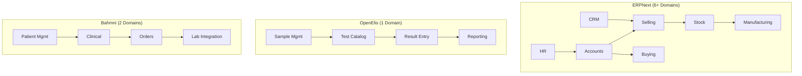
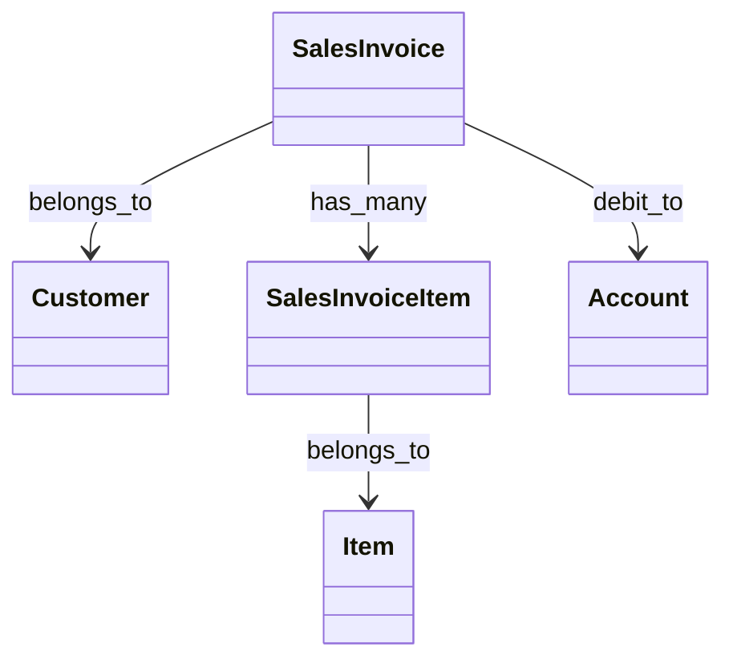

# Choosing Your Project

> **Decision Point**: Which codebase will you analyze for your pre-internship exercise?

---

## The Three Options

You have three open-source enterprise systems to choose from. Each offers different learning opportunities.

```
┌─────────────────────────────────────────────────────────────────────────┐
│                        YOUR PROJECT CHOICES                              │
├─────────────────────────────────────────────────────────────────────────┤
│                                                                          │
│  OPTION A: ERPNext                    OPTION B: OpenElis                │
│  ─────────────────                    ──────────────────                │
│  Language: Python                     Language: Java                     │
│  Domain: Business ERP                 Domain: Lab Information           │
│  Complexity: Medium                   Complexity: Medium                 │
│  Best For: Beginners                  Best For: Healthcare interest     │
│                                                                          │
│                      OPTION C: Bahmni-Core                              │
│                      ─────────────────────                              │
│                      Language: Java                                      │
│                      Domain: Healthcare EMR                              │
│                      Complexity: Medium-Hard                             │
│                      Best For: Deep healthcare focus                     │
│                                                                          │
└─────────────────────────────────────────────────────────────────────────┘
```

---

## Detailed Comparison

### Option A: ERPNext (Recommended for Beginners)

| Attribute | Value |
|-----------|-------|
| **Repository** | [github.com/frappe/erpnext](https://github.com/frappe/erpnext) |
| **Language** | Python (Frappe Framework) |
| **Domain** | Full Business ERP (Accounting, Inventory, HR, Manufacturing, CRM) |
| **Size** | ~2,500 Python files |
| **Documentation** | Excellent |

**Why Choose ERPNext:**

1. **Richest Domain Learning**
   - 6+ interconnected business domains
   - Accounting, Sales, Inventory, Manufacturing, HR, CRM
   - You'll learn how real business systems work

2. **Clear Code Patterns**
   - Frappe DocTypes = clear entity definitions (JSON schemas)
   - Business logic in Python files
   - Explicit hooks (`on_submit`, `validate`, `before_save`)

3. **Easiest to Parse**
   - Python is readable
   - Structured file layout (`doctype/<name>/<name>.py`)
   - Metadata in JSON files

**Suggested Focus Area:**
```
erpnext/erpnext/accounts/doctype/sales_invoice/
├── sales_invoice.json    ← Entity schema (fields, relationships)
├── sales_invoice.py      ← Business logic (validation, calculations)
└── sales_invoice.js      ← UI behavior
```

**What You'll Extract:**
- Sales Invoice entity with all fields
- Relationships to Customer, Item, Account
- Business rules (tax calculation, discount logic, credit limit check)

---

### Option B: OpenElis (Lab Information System)

| Attribute | Value |
|-----------|-------|
| **Repository** | [github.com/Bahmni/OpenElis](https://github.com/Bahmni/OpenElis) |
| **Language** | Java |
| **Domain** | Laboratory Information Management |
| **Size** | ~1,600 Java files |
| **Documentation** | Moderate |

**Why Choose OpenElis:**

1. **Bounded Context**
   - Lab systems are naturally isolated
   - Clear input/output: Samples in → Results out
   - Easier to understand the whole system

2. **Healthcare Exposure**
   - Learn medical domain terminology
   - Understand compliance requirements
   - Real-world healthcare workflows

3. **Workflow-Centric**
   - Sample collection → Test assignment → Analysis → Results → Reporting
   - Clear state machines

**Suggested Focus Area:**
```
OpenElis/openelis/src/
├── org/openelis/domain/    ← Domain entities
├── org/openelis/service/   ← Business logic
└── org/openelis/manager/   ← Workflow managers
```

**What You'll Extract:**
- Sample, Test, Result entities
- Lab workflow (Order → Collection → Analysis → Validation → Report)
- Validation rules for result ranges

---

### Option C: Bahmni-Core (Healthcare EMR)

| Attribute | Value |
|-----------|-------|
| **Repository** | [github.com/Bahmni/bahmni-core](https://github.com/Bahmni/bahmni-core) |
| **Language** | Java (Spring, OpenMRS) |
| **Domain** | Electronic Medical Records |
| **Size** | ~800 Java files |
| **Documentation** | Moderate |

**Why Choose Bahmni:**

1. **Deep Healthcare Domain**
   - Patient management
   - Clinical encounters
   - Diagnoses and observations
   - Medical compliance

2. **Real-World Complexity**
   - OpenMRS platform integration
   - Multiple module dependencies
   - Healthcare standards (FHIR)

3. **Challenging but Rewarding**
   - More complex architecture
   - Good for those who want a challenge

**Suggested Focus Area:**
```
bahmni-core/bahmnicore-api/src/main/java/
├── org/bahmni/module/bahmnicore/service/    ← Services
└── org/bahmni/module/bahmnicore/model/      ← Domain models
```

**What You'll Extract:**
- Patient, Encounter, Observation entities
- Clinical workflow (Registration → Consultation → Diagnosis → Treatment)
- Validation rules

---

## Quick Decision Matrix

```
┌─────────────────────────────────────────────────────────────────────────┐
│                    WHICH PROJECT SHOULD YOU CHOOSE?                      │
├─────────────────────────────────────────────────────────────────────────┤
│                                                                          │
│  "I want the easiest path to success"                                   │
│  └── Choose ERPNext (Option A)                                          │
│                                                                          │
│  "I'm interested in healthcare/medical systems"                          │
│  └── Choose OpenElis (Option B) or Bahmni (Option C)                    │
│                                                                          │
│  "I know Java well and want a challenge"                                │
│  └── Choose Bahmni (Option C)                                           │
│                                                                          │
│  "I know Python and want rich domain learning"                          │
│  └── Choose ERPNext (Option A)                                          │
│                                                                          │
│  "I want to understand a complete bounded system"                        │
│  └── Choose OpenElis (Option B)                                         │
│                                                                          │
└─────────────────────────────────────────────────────────────────────────┘
```

---

## Domain Richness Comparison



---

## What Success Looks Like

### For ERPNext (Option A)

**Minimum Success:**
```json
{
  "entity": "SalesInvoice",
  "fields": ["customer", "posting_date", "total", "items"],
  "methods": ["validate", "on_submit", "calculate_taxes"],
  "relationships": {
    "customer": "Customer",
    "items": "SalesInvoiceItem"
  }
}
```

**Stretch Success:**


### For OpenElis (Option B)

**Minimum Success:**
```json
{
  "workflow": "Lab Order Processing",
  "steps": [
    {"name": "Order Creation", "entities": ["LabOrder", "Patient"]},
    {"name": "Sample Collection", "entities": ["Sample", "Barcode"]},
    {"name": "Test Assignment", "entities": ["Test", "Panel"]},
    {"name": "Result Entry", "entities": ["Result", "Range"]}
  ]
}
```

### For Bahmni (Option C)

**Minimum Success:**
```json
{
  "entity": "Encounter",
  "relationships": {
    "patient": "Patient",
    "observations": "Observation[]",
    "diagnoses": "Diagnosis[]",
    "orders": "Order[]"
  }
}
```

---

## Getting Started

### Step 1: Clone Your Chosen Repository

```bash
# Option A: ERPNext
git clone --depth 1 https://github.com/frappe/erpnext.git
cd erpnext

# Option B: OpenElis
git clone --depth 1 https://github.com/Bahmni/OpenElis.git
cd OpenElis

# Option C: Bahmni
git clone --depth 1 https://github.com/Bahmni/bahmni-core.git
cd bahmni-core
```

### Step 2: Explore the Structure

```bash
# Find all source files
find . -name "*.py" | head -20  # For ERPNext
find . -name "*.java" | head -20  # For OpenElis/Bahmni

# Look at a specific file
cat erpnext/accounts/doctype/sales_invoice/sales_invoice.py
```

### Step 3: Start Your Tool

Begin with simple file discovery, then add parsing.

---

## Still Can't Decide?

**Default to ERPNext (Option A).**

It has:
- Best documentation
- Clearest patterns
- Richest domain for learning
- Python (easier than Java for parsing)

You can always explore the others after completing your Week-1 exercise.

---

## Related

- [Pre-Internship Requirements](../08-Exercises/01-Pre-Internship-Requirements.md)
- [ERPNext Deep Dive](./02-ERPNext-Domain-Analysis.md)
- [OpenElis Deep Dive](./03-OpenElis-Domain-Analysis.md)
- [Bahmni Deep Dive](./04-Bahmni-Core-Domain-Analysis.md)
