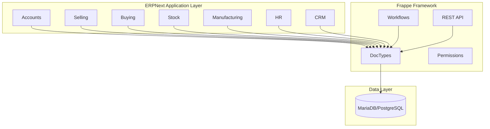
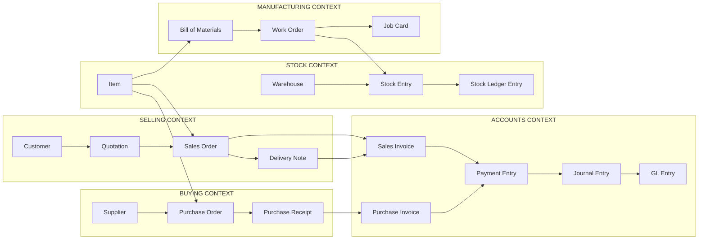
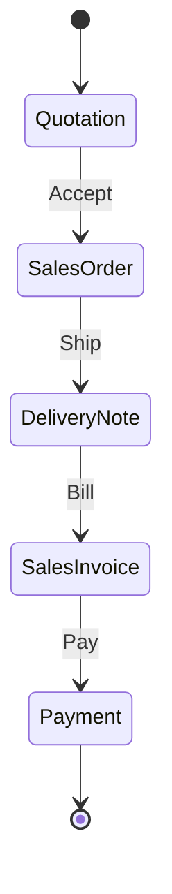
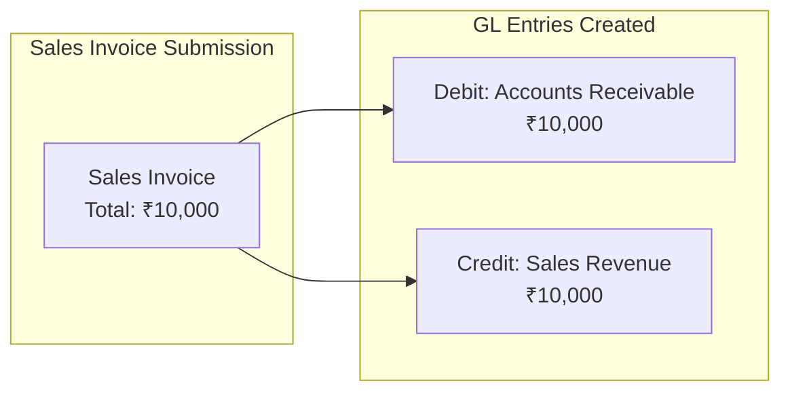
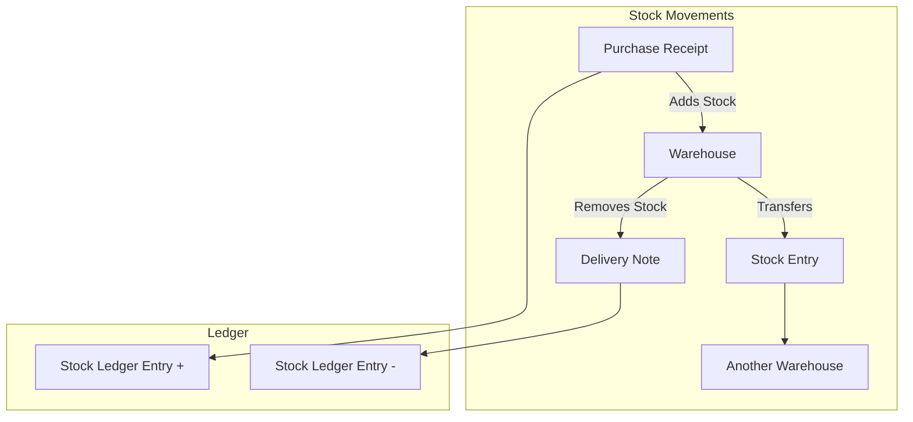
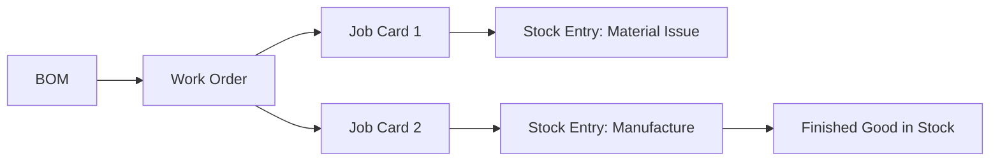
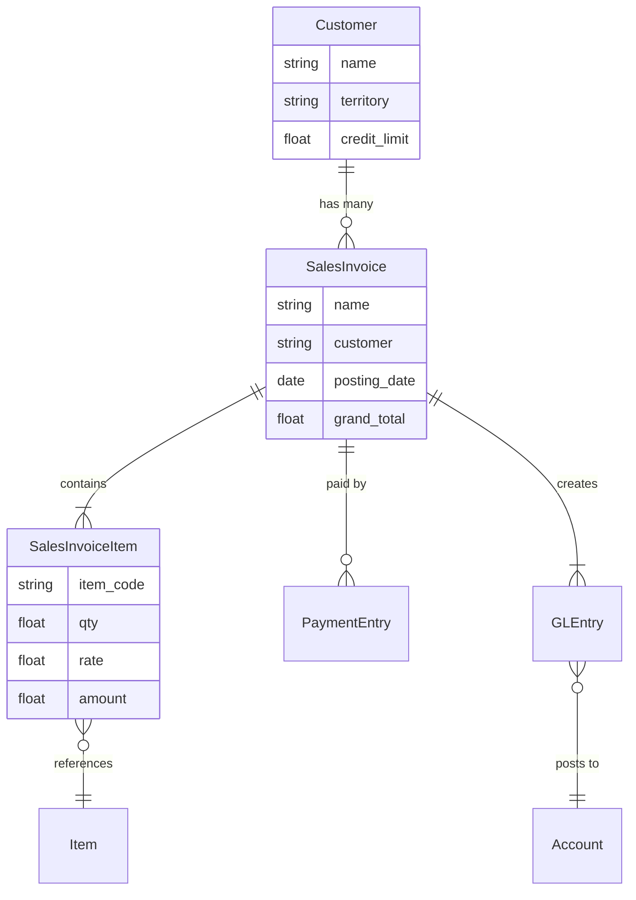

# ERPNext Domain Analysis

> **The richest learning ground**: 6+ interconnected business domains in one codebase

---

## Overview

| Attribute | Value |
|-----------|-------|
| **Repository** | [github.com/frappe/erpnext](https://github.com/frappe/erpnext) |
| **Framework** | Frappe (Python) |
| **Language** | Python 93%, JavaScript 7% |
| **Size** | ~2,500 Python files |
| **License** | GPL v3 |

ERPNext is a **full-featured ERP system** covering accounting, inventory, HR, manufacturing, CRM, and more. It's built on the **Frappe framework**, which provides a declarative way to define business entities (DocTypes).

---

## Architecture Overview



---

## Domain Map



---

## Bounded Contexts

### 1. Selling Context

**Purpose**: Manage customer relationships and sales transactions.

**Key Entities:**

| Entity | Description | Key Fields |
|--------|-------------|------------|
| `Customer` | Someone who buys | name, territory, credit_limit |
| `Quotation` | Price proposal | customer, items[], valid_till |
| `Sales Order` | Confirmed order | customer, items[], delivery_date |
| `Delivery Note` | Shipment record | customer, items[], warehouse |
| `Sales Invoice` | Bill to customer | customer, items[], taxes[], total |

**Workflow:**


---

### 2. Accounts Context

**Purpose**: Financial record-keeping, compliance, reporting.

**Key Entities:**

| Entity | Description | Key Fields |
|--------|-------------|------------|
| `Account` | Chart of accounts entry | name, account_type, parent |
| `Sales Invoice` | AR document | customer, items[], taxes[] |
| `Purchase Invoice` | AP document | supplier, items[], taxes[] |
| `Payment Entry` | Money movement | party, paid_amount, mode |
| `Journal Entry` | Manual GL entry | accounts[], debit, credit |
| `GL Entry` | Ledger record | account, debit, credit, voucher |

**Double-Entry Flow:**


---

### 3. Stock Context

**Purpose**: Inventory management, warehouse operations.

**Key Entities:**

| Entity | Description | Key Fields |
|--------|-------------|------------|
| `Item` | Product/service | item_code, item_name, stock_uom |
| `Warehouse` | Storage location | warehouse_name, parent_warehouse |
| `Stock Entry` | Inventory movement | stock_entry_type, items[] |
| `Stock Ledger Entry` | Inventory record | item, warehouse, qty, valuation |
| `Batch` | Lot tracking | batch_id, item, expiry_date |
| `Serial No` | Unit tracking | serial_no, item, status |

**Stock Flow:**


---

### 4. Buying Context

**Purpose**: Procurement, supplier management.

**Key Entities:**

| Entity | Description | Key Fields |
|--------|-------------|------------|
| `Supplier` | Vendor | supplier_name, supplier_type |
| `Material Request` | Internal demand | items[], material_request_type |
| `Purchase Order` | Order to supplier | supplier, items[], schedule_date |
| `Purchase Receipt` | Goods received | supplier, items[], warehouse |
| `Purchase Invoice` | Supplier bill | supplier, items[], taxes[] |

---

### 5. Manufacturing Context

**Purpose**: Production planning and execution.

**Key Entities:**

| Entity | Description | Key Fields |
|--------|-------------|------------|
| `BOM` | Bill of Materials | item, items[], operations[] |
| `Work Order` | Production order | production_item, qty, bom |
| `Job Card` | Operation tracking | work_order, operation, time |
| `Workstation` | Machine/station | workstation_name, hour_rate |

**Manufacturing Flow:**


---

## DocType Pattern (Frappe Framework)

Every entity in ERPNext is a **DocType**. Understanding this pattern is key.

### File Structure

```
erpnext/accounts/doctype/sales_invoice/
├── sales_invoice.json      ← Schema definition
├── sales_invoice.py        ← Business logic
├── sales_invoice.js        ← Client-side behavior
└── test_sales_invoice.py   ← Tests
```

### Schema (sales_invoice.json)

```json
{
  "doctype": "DocType",
  "name": "Sales Invoice",
  "fields": [
    {
      "fieldname": "customer",
      "fieldtype": "Link",
      "options": "Customer",
      "reqd": 1
    },
    {
      "fieldname": "posting_date",
      "fieldtype": "Date",
      "default": "Today"
    },
    {
      "fieldname": "items",
      "fieldtype": "Table",
      "options": "Sales Invoice Item"
    },
    {
      "fieldname": "grand_total",
      "fieldtype": "Currency",
      "read_only": 1
    }
  ]
}
```

### Business Logic (sales_invoice.py)

```python
class SalesInvoice(SellingController):
    def validate(self):
        """Called before save - validation rules"""
        self.validate_posting_time()
        self.validate_customer()
        self.check_credit_limit()          # ← Business Rule
        self.calculate_taxes_and_totals()  # ← Business Rule

    def on_submit(self):
        """Called when document is submitted"""
        self.update_stock_ledger()         # ← Side Effect
        self.make_gl_entries()             # ← Accounting
        self.update_outstanding_amt()      # ← AR Update

    def check_credit_limit(self):
        """Business rule: Customer cannot exceed credit limit"""
        customer = frappe.get_doc("Customer", self.customer)
        if customer.credit_limit and self.grand_total > customer.credit_limit:
            frappe.throw("Credit limit exceeded")
```

---

## Suggested Focus for Week 1

### Start Here: Sales Invoice

**Path**: `erpnext/accounts/doctype/sales_invoice/`

**Why:**
1. Touches multiple domains (Selling, Accounts, Stock)
2. Clear business rules (tax, discount, credit limit)
3. Good example of the DocType pattern
4. Rich relationships to extract

### What to Extract

1. **Entity Schema** from `sales_invoice.json`
   - All fields with types
   - Link relationships (customer → Customer)
   - Child tables (items → Sales Invoice Item)

2. **Business Rules** from `sales_invoice.py`
   - `validate()` methods
   - `on_submit()` hooks
   - Calculations

3. **Relationships**
   - What other DocTypes does it reference?
   - What references it?

### Expected Output

```json
{
  "entity": "SalesInvoice",
  "fields": [
    {"name": "customer", "type": "Link", "target": "Customer"},
    {"name": "posting_date", "type": "Date"},
    {"name": "items", "type": "Table", "target": "SalesInvoiceItem"},
    {"name": "grand_total", "type": "Currency"}
  ],
  "methods": [
    {"name": "validate", "calls": ["validate_posting_time", "check_credit_limit"]},
    {"name": "on_submit", "calls": ["update_stock_ledger", "make_gl_entries"]}
  ],
  "business_rules": [
    "Credit limit check before save",
    "Tax calculation on items",
    "GL entry creation on submit"
  ]
}
```

---

## Relationships Diagram



---

## Key Files to Analyze

| Purpose | Path |
|---------|------|
| **Main entity** | `accounts/doctype/sales_invoice/sales_invoice.py` |
| **Schema** | `accounts/doctype/sales_invoice/sales_invoice.json` |
| **Line items** | `accounts/doctype/sales_invoice_item/` |
| **Parent controller** | `controllers/selling_controller.py` |
| **Tax logic** | `controllers/taxes_and_totals.py` |
| **GL posting** | `accounts/general_ledger.py` |

---

## Real Code Insights (Extracted via CodeCompass)

### Discount Calculation Flow

The discount logic in ERPNext lives in `public/js/controllers/taxes_and_totals.js`:

```javascript
// Key methods in TaxesAndTotals class:

calculate_discount_amount() {
    // Triggered during tax calculation
    this.set_discount_amount();
    this.apply_discount_amount();
}

apply_pricing_rule_on_item(item) {
    // Margin calculation (percentage or fixed)
    if (item.margin_type == "Percentage") {
        item.rate_with_margin = effective_rate + (effective_rate * margin / 100);
    } else {
        item.rate_with_margin = effective_rate + margin;
    }

    // Discount can be percentage OR amount
    if (item.discount_percentage && !item.discount_amount) {
        item.discount_amount = (rate_with_margin * discount_percentage) / 100;
    }

    // Final rate = margin rate - discount
    item_rate = rate_with_margin - discount_amount;
}
```

**Business Rules Found:**
- Margins can be percentage-based or fixed amount
- Discounts can be percentage or absolute
- Cash discounts handled separately from trade discounts
- Grand total adjustment for "apply discount on grand total" option

### Accounting Entry Flow

When a Sales Invoice is submitted, GL entries are created:

```
Sales Invoice Submit
    ↓
make_gl_entries()
    ↓
┌────────────────────────────────────────┐
│ Debit: Accounts Receivable (Customer)  │
│ Credit: Revenue Account                │
│ Credit: Tax Account (if applicable)    │
└────────────────────────────────────────┘
```

### Key Controllers Inheritance

```
BaseDocument (Frappe)
    ↓
TransactionBase (ERPNext)
    ↓
AccountsController
    ↓
SellingController / BuyingController
    ↓
SalesInvoice / PurchaseInvoice
```

Each level adds business logic:
- **AccountsController**: Tax, currency, GL entries
- **SellingController**: Customer validation, pricing rules
- **SalesInvoice**: Invoice-specific rules

---

## Resources

- [ERPNext Documentation](https://docs.erpnext.com/)
- [Frappe Framework Guide](https://frappeframework.com/docs)
- [ERPNext GitHub](https://github.com/frappe/erpnext)

---

## Related

- [Choosing Your Project](./01-Choosing-Your-Project.md)
- [OpenElis Analysis](./03-OpenElis-Domain-Analysis.md)
- [Bahmni Analysis](./04-Bahmni-Core-Domain-Analysis.md)
- [Week 1 Requirements](../08-Exercises/01-Pre-Internship-Requirements.md)
