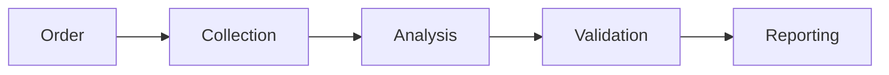
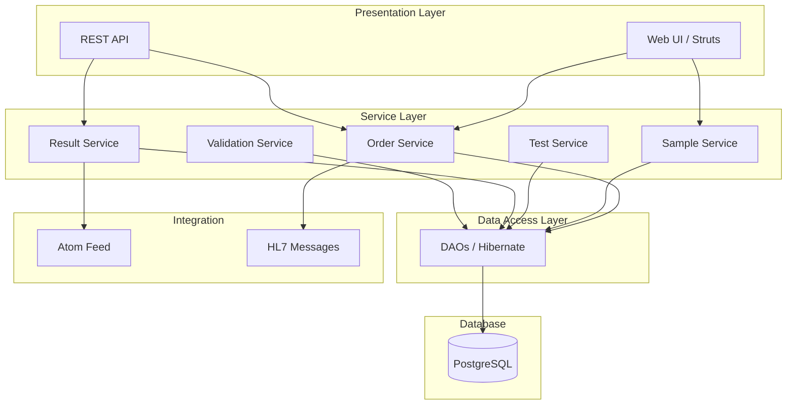
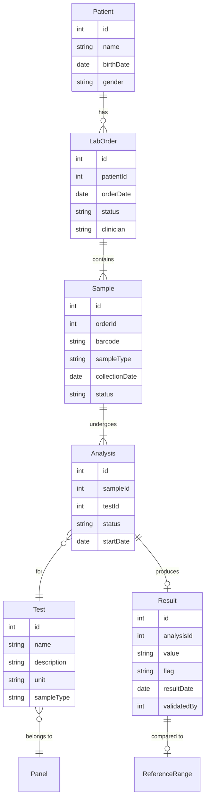
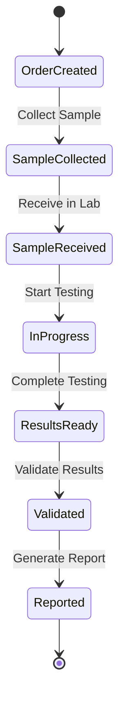
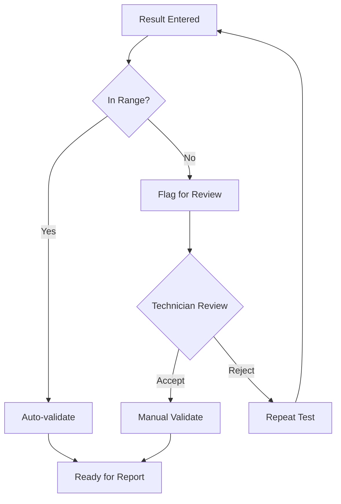
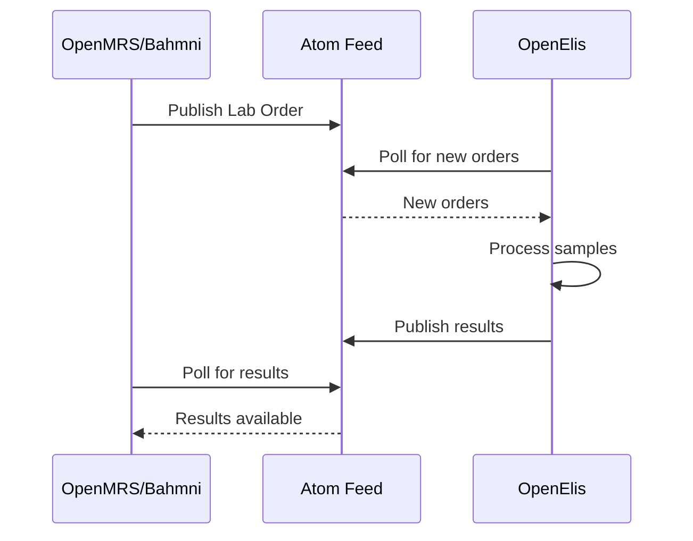

# OpenElis Domain Analysis

> **The bounded context**: A complete Lab Information System in one domain

---

## Overview

| Attribute | Value |
|-----------|-------|
| **Repository** | [github.com/Bahmni/OpenElis](https://github.com/Bahmni/OpenElis) |
| **Language** | Java 91%, PLpgSQL 5% |
| **Domain** | Laboratory Information Management |
| **Size** | ~1,600 Java files |
| **License** | MPL 2.0 |

OpenElis is a **Laboratory Information Management System (LIMS)** that manages lab workflows: test ordering, sample collection, result entry, and reporting.

---

## Why OpenElis for Learning?

### 1. Naturally Bounded

Unlike ERPNext (6+ domains), OpenElis is **one bounded context**:
- Samples go in
- Results come out
- Clear boundaries

### 2. Healthcare Domain Exposure

Learn medical/lab terminology:
- Specimens, analytes, panels
- Reference ranges, flags
- QC, validation, accreditation

### 3. Clear Workflow

The lab workflow is linear and understandable:



---

## Architecture Overview



---

## Domain Model

### Core Entities



---

## Lab Workflow Detail

### 1. Order Entry



### 2. Sample Flow

```
┌─────────────────────────────────────────────────────────────────────────┐
│                         SAMPLE LIFECYCLE                                 │
├─────────────────────────────────────────────────────────────────────────┤
│                                                                          │
│  1. COLLECTION                                                          │
│     └── Generate barcode                                                 │
│     └── Assign sample type (blood, urine, etc.)                         │
│     └── Record collection time                                          │
│                                                                          │
│  2. RECEPTION                                                           │
│     └── Verify barcode                                                  │
│     └── Check sample quality                                            │
│     └── Log receipt time                                                │
│                                                                          │
│  3. PROCESSING                                                          │
│     └── Assign to analyzer/technician                                   │
│     └── Run tests                                                       │
│     └── Record results                                                  │
│                                                                          │
│  4. DISPOSAL                                                            │
│     └── Archive or dispose                                              │
│     └── Maintain audit trail                                            │
│                                                                          │
└─────────────────────────────────────────────────────────────────────────┘
```

### 3. Result Validation



---

## Key Code Areas

### Directory Structure

```
OpenElis/openelis/src/
├── org/openelis/
│   ├── domain/           ← Domain entities (Patient, Sample, Test)
│   ├── manager/          ← Business logic managers
│   ├── service/          ← Service layer
│   ├── dao/              ← Data access objects
│   ├── action/           ← Struts actions (controllers)
│   └── common/           ← Utilities
```

### Key Classes

| Class | Purpose | Location |
|-------|---------|----------|
| `Sample` | Sample entity | `domain/Sample.java` |
| `Analysis` | Test assignment | `domain/Analysis.java` |
| `Result` | Test result | `domain/Result.java` |
| `SampleManager` | Sample business logic | `manager/SampleManager.java` |
| `ResultValidationManager` | Validation rules | `manager/ResultValidationManager.java` |
| `SampleDAO` | Sample persistence | `dao/SampleDAO.java` |

---

## Business Rules to Extract

### 1. Sample Validation Rules

```java
// What you'll find in the code:

// Rule: Sample must be collected within 24 hours of order
if (sample.getCollectionDate().isAfter(order.getOrderDate().plusHours(24))) {
    throw new ValidationException("Sample collection expired");
}

// Rule: Sample type must match test requirements
if (!test.getRequiredSampleType().equals(sample.getSampleType())) {
    throw new ValidationException("Invalid sample type for test");
}
```

### 2. Result Validation Rules

```java
// Rule: Result must be within reference range or flagged
ReferenceRange range = getReferenceRange(test, patient);
if (result.getValue() < range.getLow()) {
    result.setFlag("L");  // Low
} else if (result.getValue() > range.getHigh()) {
    result.setFlag("H");  // High
} else {
    result.setFlag("N");  // Normal
}

// Rule: Critical values require immediate notification
if (result.getValue() < range.getCriticalLow() ||
    result.getValue() > range.getCriticalHigh()) {
    notificationService.sendCriticalAlert(result);
}
```

### 3. QC Rules

```java
// Rule: QC sample must pass before patient samples
QCResult qcResult = qcService.getLatestQCResult(test);
if (!qcResult.isPassing()) {
    throw new QCFailureException("Cannot run patient samples - QC failed");
}
```

---

## Suggested Week-1 Focus

### Target: Sample Management Flow

**Files to analyze:**

```
OpenElis/openelis/src/org/openelis/
├── domain/Sample.java         ← Entity definition
├── manager/SampleManager.java ← Business logic
├── dao/SampleDAO.java         ← Persistence
└── action/SampleAction.java   ← Controller
```

### What to Extract

1. **Sample Entity**
   - Fields (barcode, sampleType, status, collectionDate)
   - Relationships (to Order, to Analysis)

2. **Sample Lifecycle**
   - Status transitions
   - Validation rules at each step

3. **Business Rules**
   - Collection time limits
   - Sample type validation
   - Barcode uniqueness

### Expected Output

```json
{
  "entity": "Sample",
  "fields": [
    {"name": "id", "type": "int", "primaryKey": true},
    {"name": "barcode", "type": "String", "unique": true},
    {"name": "sampleType", "type": "String"},
    {"name": "status", "type": "String"},
    {"name": "collectionDate", "type": "Date"},
    {"name": "orderId", "type": "int", "foreignKey": "LabOrder"}
  ],
  "statusTransitions": [
    {"from": "CREATED", "to": "COLLECTED"},
    {"from": "COLLECTED", "to": "RECEIVED"},
    {"from": "RECEIVED", "to": "IN_PROGRESS"},
    {"from": "IN_PROGRESS", "to": "COMPLETED"}
  ],
  "validationRules": [
    "Barcode must be unique",
    "Collection date must be within 24 hours of order",
    "Sample type must match test requirements"
  ]
}
```

---

## Integration Points

### Atom Feed (to OpenMRS/Bahmni)

OpenElis syncs with OpenMRS via Atom feeds:



### Key Integration Files

| File | Purpose |
|------|---------|
| `AtomFeedClient.java` | Consume orders from EMR |
| `ResultFeedPublisher.java` | Publish results to EMR |
| `HL7MessageHandler.java` | HL7 message processing |

---

## Technical Debt (Documented!)

The README explicitly mentions:

1. **Transaction management issues** - Hibernate sessions not properly managed
2. **Session-based pagination** - Should be stateless
3. **Code duplication** - ResultValidationPaging, ResultsPaging, AnalyzerResultsPaging

These are **great learning opportunities** for understanding:
- Why technical debt accumulates
- What "proper" architecture looks like
- Common legacy system patterns

---

## Getting Started

```bash
# Clone the repository
git clone --depth 1 https://github.com/Bahmni/OpenElis.git
cd OpenElis

# Find key files
find . -name "Sample*.java" | head -10
find . -name "*Manager.java" | head -10

# Look at the domain model
cat openelis/src/org/openelis/domain/Sample.java
```

---

## Related

- [Choosing Your Project](./01-Choosing-Your-Project.md)
- [ERPNext Analysis](./02-ERPNext-Domain-Analysis.md)
- [Bahmni Analysis](./04-Bahmni-Core-Domain-Analysis.md)
- [Week 1 Requirements](../08-Exercises/01-Pre-Internship-Requirements.md)
