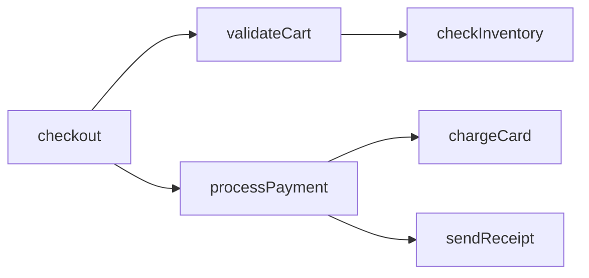

# What Is Code Intelligence?

> **Definition**: Tools that help humans understand codebases they didn't write.

---

## The Problem

Modern software is complex. A typical enterprise system has:
- **Millions of lines** of code
- **Thousands of files** across hundreds of directories
- **Years of history** with multiple generations of developers
- **Implicit knowledge** that exists only in the code

No human can hold all this in their head.

```
┌─────────────────────────────────────────────────────────────────────────┐
│                    THE UNDERSTANDING GAP                                 │
├─────────────────────────────────────────────────────────────────────────┤
│                                                                          │
│  What developers need to know:                                          │
│  • How does feature X work?                                             │
│  • What would break if I change Y?                                      │
│  • Where is the business rule for Z?                                    │
│  • Who calls this function?                                             │
│  • Why does this code exist?                                            │
│                                                                          │
│  What developers have:                                                  │
│  • grep                                                                  │
│  • "Ask Bob" (Bob left 2 years ago)                                     │
│  • Outdated documentation                                               │
│  • Hours of reading unfamiliar code                                     │
│                                                                          │
│  Code Intelligence fills this gap.                                      │
│                                                                          │
└─────────────────────────────────────────────────────────────────────────┘
```

---

## What Code Intelligence Tools Do

### 1. Extract Structure

Turn raw code into structured data:

```
Source Code                          Structured Output
─────────────                        ─────────────────
class SalesInvoice:          →       {
  def validate(self):                  "type": "class",
    self.check_credit()                "name": "SalesInvoice",
    self.calculate_tax()               "methods": [
                                         "validate",
                                         "check_credit",
                                         "calculate_tax"
                                       ],
                                       "calls": [...]
                                     }
```

### 2. Build Relationships

Understand how code connects:



### 3. Enable Search

Find code by **meaning**, not just keywords:

| Traditional Search | Code Intelligence |
|-------------------|-------------------|
| `grep "calculate"` | "how is discount computed?" |
| Finds: `calculateTax`, `calculateFoo` | Finds: `applyDiscount`, `priceAfterPromo` |
| Keyword match only | Understands intent |

### 4. Answer Questions

Natural language queries about code:

```
Q: "How does the checkout process work?"

A: The checkout flow:
   1. CheckoutController.submit() - Entry point
   2. CartService.validate() - Checks inventory, prices
   3. PaymentService.process() - Charges payment method
   4. OrderService.create() - Creates order record
   5. NotificationService.send() - Emails confirmation
```

---

## Components of a Code Intelligence System

```
┌─────────────────────────────────────────────────────────────────────────┐
│                  CODE INTELLIGENCE ARCHITECTURE                          │
├─────────────────────────────────────────────────────────────────────────┤
│                                                                          │
│  1. INGESTION                                                           │
│  ───────────────                                                        │
│  Source Code → Parser → Structured Chunks                               │
│               (AST or text-based)                                       │
│                                                                          │
│  2. INDEXING                                                            │
│  ───────────────                                                        │
│  Chunks → Embeddings → Vector Database                                  │
│        → Graph Edges → Graph Database                                   │
│                                                                          │
│  3. RETRIEVAL                                                           │
│  ───────────────                                                        │
│  Query → Vector Search → Relevant Chunks                                │
│       → Graph Traversal → Related Code                                  │
│                                                                          │
│  4. SYNTHESIS                                                           │
│  ───────────────                                                        │
│  Retrieved Code + Query → LLM → Human-readable Answer                   │
│                                                                          │
└─────────────────────────────────────────────────────────────────────────┘
```

---

## Key Capabilities

### Symbol Extraction

Identify code elements: classes, functions, methods, variables.

```python
# Input
class OrderService:
    def create_order(self, items: List[Item]) -> Order:
        """Creates a new order from cart items."""
        order = Order()
        for item in items:
            order.add_line(item)
        return order

# Output
{
  "type": "class",
  "name": "OrderService",
  "methods": [{
    "name": "create_order",
    "params": ["items: List[Item]"],
    "returns": "Order",
    "docstring": "Creates a new order from cart items."
  }]
}
```

### Call Graph Analysis

Who calls whom?

```python
# Analysis reveals:
# CheckoutController.submit() → OrderService.create_order()
# OrderService.create_order() → Order.add_line()
# OrderService.create_order() → InventoryService.reserve()
```

### Dependency Mapping

What imports/uses what?

```
sales_invoice.py
├── imports: frappe, json, datetime
├── uses_doctypes: Customer, Item, Account
└── extends: SellingController
```

### Semantic Search

Find by meaning:

```
Query: "discount calculation"
Results:
  1. pricing_rules.py:apply_discount() - 95% match
  2. sales_invoice.py:calculate_total() - 87% match
  3. promotions.py:get_promo_discount() - 82% match
```

### Impact Analysis

What breaks if I change this?

```
Change: Modify Order.total field

Impact:
  - 47 direct references
  - 12 services use Order.total
  - 3 API endpoints return total
  - 8 reports calculate from total
  - Risk Level: HIGH
```

---

## How It Differs from IDE Features

| Feature | IDE (VS Code, etc.) | Code Intelligence |
|---------|---------------------|-------------------|
| **Go to definition** | Yes, for current file context | Yes, across entire codebase |
| **Find references** | Syntax-based | Semantic + syntax |
| **Search** | Text/regex | Natural language |
| **Understand intent** | No | Yes (with LLM) |
| **Cross-repo analysis** | Limited | Full support |
| **Business rule extraction** | No | Yes |
| **Impact analysis** | Basic | Comprehensive |

---

## Technologies Used

### Parsing

| Technology | What It Does | When to Use |
|------------|--------------|-------------|
| **tree-sitter** | Fast AST parsing, 50+ languages | Production systems |
| **Regex** | Pattern matching | Simple extraction |
| **Language servers** | IDE-grade analysis | When available |

### Embeddings

| Technology | What It Does | When to Use |
|------------|--------------|-------------|
| **Ollama** | Local embedding models | Privacy-sensitive |
| **OpenAI** | Cloud embeddings | Quality-focused |
| **Sentence Transformers** | Open-source models | Customization |

### Storage

| Technology | What It Does | When to Use |
|------------|--------------|-------------|
| **LanceDB** | Embedded vector DB | Local-first |
| **Pinecone** | Cloud vector DB | Scale |
| **SQLite** | Metadata storage | Always |
| **Neo4j** | Graph database | Complex relationships |

### Synthesis

| Technology | What It Does | When to Use |
|------------|--------------|-------------|
| **Claude/GPT-4** | High-quality answers | Production |
| **Llama/Mistral** | Local LLMs | Privacy |
| **Groq** | Fast inference | Speed-critical |

---

## What You'll Build This Week

A **minimal code intelligence tool** that:

1. **Reads** source files from a directory
2. **Extracts** symbols (functions, classes, methods)
3. **Outputs** structured JSON
4. **Optionally** generates a Mermaid diagram

```
┌─────────────────────────────────────────────────────────────────────────┐
│                    YOUR WEEK-1 DELIVERABLE                               │
├─────────────────────────────────────────────────────────────────────────┤
│                                                                          │
│  INPUT:  A directory of Python/Java files                               │
│                                                                          │
│  YOUR TOOL:                                                             │
│  ┌─────────────────────────────────────────┐                           │
│  │  1. Find all source files               │                           │
│  │  2. Parse each file                     │                           │
│  │  3. Extract classes/functions           │                           │
│  │  4. Output structured data              │                           │
│  └─────────────────────────────────────────┘                           │
│                                                                          │
│  OUTPUT:                                                                │
│  • entities.json (what you found)                                       │
│  • diagram.mermaid (relationships)                                      │
│  • summary.md (explanation)                                             │
│                                                                          │
└─────────────────────────────────────────────────────────────────────────┘
```

---

## Commercial Examples

| Tool | Focus | Approach |
|------|-------|----------|
| **Sourcegraph** | Code search | Graph + text search |
| **GitHub Copilot** | Code completion | LLM + context |
| **Cursor** | AI editor | Embeddings + LLM |
| **Amazon Q** | AWS migration | Pattern matching |
| **CodeCompass** | Modernization | Graph + RAG |

---

## Key Takeaways

1. **Code intelligence helps humans understand code** they didn't write
2. **Key components**: Parsing, indexing, retrieval, synthesis
3. **Core capabilities**: Symbol extraction, call graphs, semantic search
4. **Technologies**: tree-sitter, embeddings, vector DBs, LLMs
5. **Your Week-1 goal**: Build a minimal working tool

---

## Related

- [Indexing Strategies](./03-Indexing-Strategies.md)
- [AST vs Text Chunking](./02-AST-vs-Text-Chunking.md)
- [Graph Extraction](./04-Graph-Extraction.md)
- [Commercial Tools Comparison](./05-Commercial-Tools.md)
- [What We Learned Building CodeCompass](./06-CodeCompass-Learnings.md)
