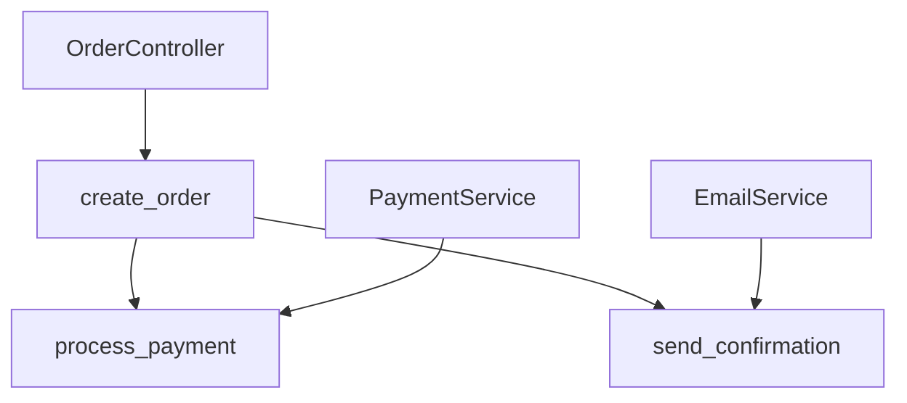

# Graph Extraction

> **Beyond search**: Understanding relationships between code elements

---

## Why Graphs?

Vector search finds **similar** code. Graphs show **relationships**.

```
┌─────────────────────────────────────────────────────────────────────────┐
│                    SEARCH vs GRAPH                                       │
├─────────────────────────────────────────────────────────────────────────┤
│                                                                          │
│  VECTOR SEARCH:                                                         │
│  "Find code similar to payment processing"                              │
│  → Returns: [PaymentService, OrderPayment, RefundHandler]               │
│  → No relationship info                                                 │
│                                                                          │
│  GRAPH QUERY:                                                           │
│  "What calls PaymentService?"                                           │
│  → Returns: OrderController → PaymentService → PaymentGateway           │
│  → Shows the actual flow                                                │
│                                                                          │
│  COMBINED:                                                              │
│  "Find payment code AND show me what depends on it"                     │
│  → Best of both worlds                                                  │
│                                                                          │
└─────────────────────────────────────────────────────────────────────────┘
```

---

## What Goes in a Code Graph?

### Nodes (Entities)

| Node Type | Example | Properties |
|-----------|---------|------------|
| **File** | `payment_service.py` | path, language, size |
| **Class** | `PaymentService` | name, file, docstring |
| **Function** | `process_payment` | name, params, returns |
| **Method** | `PaymentService.charge` | name, class, visibility |
| **Variable** | `PAYMENT_TIMEOUT` | name, type, scope |
| **Import** | `import stripe` | module, alias |

### Edges (Relationships)

| Edge Type | Meaning | Example |
|-----------|---------|---------|
| **CALLS** | Function invokes function | `create_order` → `validate_payment` |
| **IMPORTS** | File uses module | `order.py` → `payment.py` |
| **EXTENDS** | Class inherits | `PremiumCustomer` → `Customer` |
| **IMPLEMENTS** | Class implements interface | `StripeGateway` → `PaymentGateway` |
| **CONTAINS** | File contains class | `payment.py` → `PaymentService` |
| **USES** | References type | `OrderService` → `Payment` |
| **RETURNS** | Function returns type | `get_payment()` → `Payment` |

---

## Extracting Relationships

### Step 1: Parse the Code

```python
from tree_sitter import Language, Parser

def parse_file(path: str, language: str) -> dict:
    """Parse a file and extract its AST."""
    with open(path) as f:
        code = f.read()

    parser = Parser()
    parser.set_language(Language(f'build/{language}.so', language))
    tree = parser.parse(code.encode())

    return {
        'path': path,
        'code': code,
        'tree': tree
    }
```

### Step 2: Extract Symbols

```python
def extract_symbols(tree, code: str) -> list[dict]:
    """Extract classes, functions, and methods."""
    symbols = []

    def traverse(node, parent_class=None):
        # Class definitions
        if node.type == 'class_definition':
            name = get_name(node)
            symbols.append({
                'type': 'class',
                'name': name,
                'start_line': node.start_point[0],
                'end_line': node.end_point[0]
            })
            # Traverse children with class context
            for child in node.children:
                traverse(child, parent_class=name)

        # Function/method definitions
        elif node.type == 'function_definition':
            name = get_name(node)
            symbols.append({
                'type': 'method' if parent_class else 'function',
                'name': name,
                'class': parent_class,
                'start_line': node.start_point[0],
                'end_line': node.end_point[0]
            })
            for child in node.children:
                traverse(child, parent_class)

        else:
            for child in node.children:
                traverse(child, parent_class)

    traverse(tree.root_node)
    return symbols
```

### Step 3: Extract Calls

```python
def extract_calls(tree, code: str) -> list[dict]:
    """Extract function/method calls."""
    calls = []

    def traverse(node, current_function=None):
        if node.type == 'function_definition':
            current_function = get_name(node)

        elif node.type == 'call':
            callee = get_callee_name(node)
            if current_function and callee:
                calls.append({
                    'caller': current_function,
                    'callee': callee,
                    'line': node.start_point[0]
                })

        for child in node.children:
            traverse(child, current_function)

    traverse(tree.root_node)
    return calls
```

### Step 4: Extract Imports

```python
def extract_imports(tree, code: str) -> list[dict]:
    """Extract import statements."""
    imports = []

    def traverse(node):
        if node.type == 'import_statement':
            module = get_module_name(node)
            imports.append({
                'type': 'import',
                'module': module,
                'line': node.start_point[0]
            })

        elif node.type == 'import_from_statement':
            module = get_module_name(node)
            names = get_imported_names(node)
            imports.append({
                'type': 'from_import',
                'module': module,
                'names': names,
                'line': node.start_point[0]
            })

        for child in node.children:
            traverse(child)

    traverse(tree.root_node)
    return imports
```

---

## Building the Graph

### Option A: NetworkX (In-Memory)

```python
import networkx as nx

def build_graph(files: list[str]) -> nx.DiGraph:
    """Build a directed graph from code files."""
    G = nx.DiGraph()

    for file_path in files:
        parsed = parse_file(file_path, 'python')

        # Add file node
        G.add_node(file_path, type='file')

        # Extract and add symbols
        symbols = extract_symbols(parsed['tree'], parsed['code'])
        for sym in symbols:
            node_id = f"{file_path}:{sym['name']}"
            G.add_node(node_id, **sym)
            G.add_edge(file_path, node_id, type='CONTAINS')

        # Extract and add calls
        calls = extract_calls(parsed['tree'], parsed['code'])
        for call in calls:
            caller_id = f"{file_path}:{call['caller']}"
            callee_id = call['callee']  # Need to resolve
            G.add_edge(caller_id, callee_id, type='CALLS')

        # Extract and add imports
        imports = extract_imports(parsed['tree'], parsed['code'])
        for imp in imports:
            G.add_edge(file_path, imp['module'], type='IMPORTS')

    return G
```

### Option B: Neo4j (Persistent)

```python
from neo4j import GraphDatabase

class CodeGraph:
    def __init__(self, uri, user, password):
        self.driver = GraphDatabase.driver(uri, auth=(user, password))

    def add_file(self, path: str, language: str):
        with self.driver.session() as session:
            session.run(
                "MERGE (f:File {path: $path}) "
                "SET f.language = $language",
                path=path, language=language
            )

    def add_class(self, name: str, file_path: str):
        with self.driver.session() as session:
            session.run(
                "MATCH (f:File {path: $path}) "
                "MERGE (c:Class {name: $name}) "
                "MERGE (f)-[:CONTAINS]->(c)",
                path=file_path, name=name
            )

    def add_call(self, caller: str, callee: str):
        with self.driver.session() as session:
            session.run(
                "MATCH (a) WHERE a.name = $caller "
                "MATCH (b) WHERE b.name = $callee "
                "MERGE (a)-[:CALLS]->(b)",
                caller=caller, callee=callee
            )
```

### Option C: SQLite (Simple Persistence)

```python
import sqlite3

def create_graph_db(path: str):
    conn = sqlite3.connect(path)
    conn.executescript("""
        CREATE TABLE IF NOT EXISTS nodes (
            id TEXT PRIMARY KEY,
            type TEXT,
            name TEXT,
            file_path TEXT,
            properties TEXT
        );

        CREATE TABLE IF NOT EXISTS edges (
            source TEXT,
            target TEXT,
            type TEXT,
            properties TEXT,
            PRIMARY KEY (source, target, type)
        );

        CREATE INDEX IF NOT EXISTS idx_edges_source ON edges(source);
        CREATE INDEX IF NOT EXISTS idx_edges_target ON edges(target);
    """)
    return conn
```

---

## Querying the Graph

### Common Queries

```python
# 1. What does this function call?
def get_callees(G, function_name: str) -> list[str]:
    """Get all functions called by a function."""
    return [
        target for _, target, data in G.out_edges(function_name, data=True)
        if data.get('type') == 'CALLS'
    ]

# 2. What calls this function?
def get_callers(G, function_name: str) -> list[str]:
    """Get all functions that call a function."""
    return [
        source for source, _, data in G.in_edges(function_name, data=True)
        if data.get('type') == 'CALLS'
    ]

# 3. What's the impact of changing this?
def get_impact(G, node: str, depth: int = 3) -> set[str]:
    """Get all nodes affected by changing a node."""
    affected = set()
    to_visit = [node]

    for _ in range(depth):
        next_level = []
        for n in to_visit:
            for source, _, data in G.in_edges(n, data=True):
                if source not in affected:
                    affected.add(source)
                    next_level.append(source)
        to_visit = next_level

    return affected

# 4. Find the call chain
def find_path(G, start: str, end: str) -> list[str]:
    """Find call path from start to end."""
    try:
        return nx.shortest_path(G, start, end)
    except nx.NetworkXNoPath:
        return []
```

### Neo4j Queries (Cypher)

```cypher
// Find all callers of a function
MATCH (caller)-[:CALLS]->(target:Function {name: 'process_payment'})
RETURN caller.name, target.name

// Find call chain
MATCH path = (start:Function {name: 'create_order'})-[:CALLS*1..5]->(end:Function {name: 'send_email'})
RETURN path

// Find impact of change
MATCH (changed:Function {name: 'calculate_tax'})<-[:CALLS*1..3]-(affected)
RETURN DISTINCT affected.name

// Find circular dependencies
MATCH (a)-[:IMPORTS]->(b)-[:IMPORTS]->(a)
RETURN a.path, b.path
```

---

## Visualizing the Graph

### Generate Mermaid Diagram

```python
def to_mermaid(G, max_nodes: int = 50) -> str:
    """Convert graph to Mermaid diagram."""
    lines = ["graph TD"]

    # Add nodes (limited)
    nodes = list(G.nodes())[:max_nodes]
    for node in nodes:
        data = G.nodes[node]
        node_type = data.get('type', 'unknown')
        label = node.split(':')[-1] if ':' in node else node
        lines.append(f'    {safe_id(node)}["{label}"]')

    # Add edges
    for source, target, data in G.edges(data=True):
        if source in nodes and target in nodes:
            edge_type = data.get('type', '')
            if edge_type == 'CALLS':
                lines.append(f'    {safe_id(source)} --> {safe_id(target)}')
            elif edge_type == 'IMPORTS':
                lines.append(f'    {safe_id(source)} -.-> {safe_id(target)}')
            elif edge_type == 'EXTENDS':
                lines.append(f'    {safe_id(source)} ==> {safe_id(target)}')

    return '\n'.join(lines)

def safe_id(s: str) -> str:
    """Convert string to safe Mermaid ID."""
    return s.replace('/', '_').replace('.', '_').replace(':', '_')
```

### Example Output



---

## Use Cases for Modernization

### 1. Identify Entry Points

```python
def find_entry_points(G) -> list[str]:
    """Find functions that are called but call nothing external."""
    entry_points = []
    for node in G.nodes():
        if G.nodes[node].get('type') in ['function', 'method']:
            in_degree = G.in_degree(node)
            if in_degree == 0 or all(
                G.nodes[source].get('type') == 'file'
                for source, _ in G.in_edges(node)
            ):
                entry_points.append(node)
    return entry_points
```

### 2. Find Business Logic Clusters

```python
def find_clusters(G) -> list[set]:
    """Find tightly connected groups of functions."""
    # Remove non-code edges
    code_G = G.edge_subgraph([
        (u, v) for u, v, d in G.edges(data=True)
        if d.get('type') == 'CALLS'
    ])

    # Find strongly connected components
    return list(nx.strongly_connected_components(code_G))
```

### 3. Map to Bounded Contexts

```python
def suggest_contexts(G, clusters: list[set]) -> dict:
    """Suggest bounded context names based on clusters."""
    suggestions = {}

    for i, cluster in enumerate(clusters):
        # Get common words in function names
        words = []
        for node in cluster:
            name = node.split(':')[-1] if ':' in node else node
            words.extend(name.lower().split('_'))

        # Find most common word
        from collections import Counter
        common = Counter(words).most_common(1)
        if common:
            suggestions[f"context_{common[0][0]}"] = cluster
        else:
            suggestions[f"context_{i}"] = cluster

    return suggestions
```

---

## Performance Tips

| Factor | Impact | Mitigation |
|--------|--------|------------|
| **Large codebases** | Memory issues | Use Neo4j or SQLite |
| **Deep traversals** | Slow queries | Limit depth, use indexes |
| **Many edges** | Visualization clutter | Filter by type, limit nodes |
| **Resolution** | Unresolved calls | Build symbol table first |

---

## Complete Pipeline

```python
def build_code_graph(root_dir: str, output_path: str):
    """Complete graph extraction pipeline."""

    # 1. Find files
    print("Finding files...")
    files = find_source_files(root_dir, ['.py'])

    # 2. Build graph
    print("Building graph...")
    G = nx.DiGraph()

    for file_path in files:
        print(f"  Processing {file_path}")
        parsed = parse_file(str(file_path), 'python')

        # Add file
        G.add_node(str(file_path), type='file')

        # Add symbols
        symbols = extract_symbols(parsed['tree'], parsed['code'])
        for sym in symbols:
            node_id = f"{file_path}:{sym['name']}"
            G.add_node(node_id, **sym, file=str(file_path))
            G.add_edge(str(file_path), node_id, type='CONTAINS')

        # Add calls
        calls = extract_calls(parsed['tree'], parsed['code'])
        for call in calls:
            caller_id = f"{file_path}:{call['caller']}"
            G.add_edge(caller_id, call['callee'], type='CALLS')

        # Add imports
        imports = extract_imports(parsed['tree'], parsed['code'])
        for imp in imports:
            G.add_edge(str(file_path), imp['module'], type='IMPORTS')

    # 3. Save graph
    print(f"Saving to {output_path}...")
    nx.write_gexf(G, output_path)

    # 4. Generate visualization
    mermaid = to_mermaid(G)
    with open(output_path.replace('.gexf', '.mermaid'), 'w') as f:
        f.write(mermaid)

    print(f"Done! {len(G.nodes())} nodes, {len(G.edges())} edges")
    return G
```

---

## Key Takeaways

1. **Graphs complement vectors** - Use both for full understanding
2. **Start with calls + imports** - Most valuable relationships
3. **Limit visualization** - 50 nodes max for readability
4. **Persist large graphs** - SQLite or Neo4j for real projects
5. **Query patterns matter** - Impact analysis is the killer feature

---

## Related

- [Indexing Strategies](./03-Indexing-Strategies.md)
- [AST vs Text Chunking](./02-AST-vs-Text-Chunking.md)
- [CodeCompass Learnings](./06-CodeCompass-Learnings.md)
- [Bounded Contexts](../05-DDD-Concepts/02-Bounded-Contexts.md)
