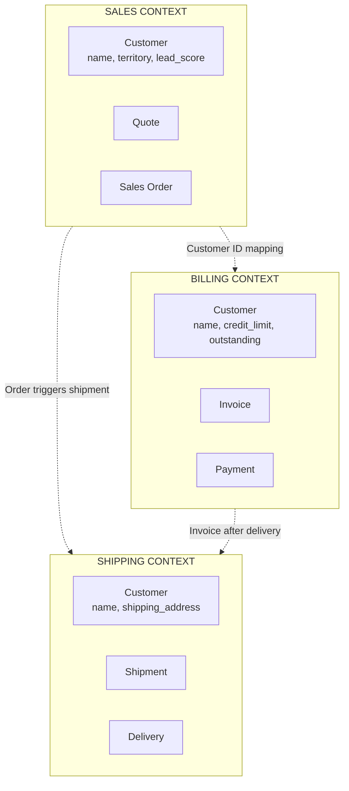
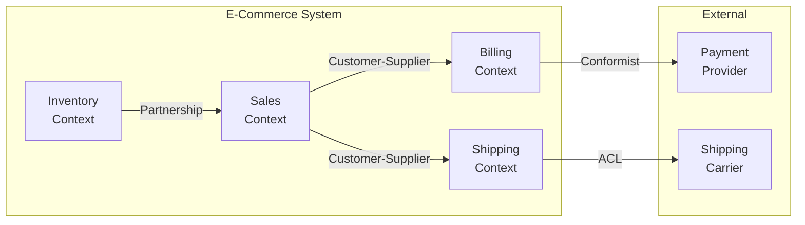

# Bounded Contexts Explained

> **The key insight**: Different parts of a system have different models for the same concepts.

---

## What Is a Bounded Context?

A **bounded context** is a boundary within which:
- A particular domain model is defined
- Terms have specific, consistent meanings
- The model is internally coherent

```
┌─────────────────────────────────────────────────────────────────────────┐
│                    THE SAME WORD, DIFFERENT MEANINGS                     │
├─────────────────────────────────────────────────────────────────────────┤
│                                                                          │
│  In SALES Context:                                                       │
│  ┌─────────────────────────────────────────────┐                        │
│  │  Customer = Person who might buy            │                        │
│  │  - name, email, territory                   │                        │
│  │  - lead_score, last_contacted               │                        │
│  └─────────────────────────────────────────────┘                        │
│                                                                          │
│  In BILLING Context:                                                     │
│  ┌─────────────────────────────────────────────┐                        │
│  │  Customer = Person who owes money           │                        │
│  │  - name, billing_address                    │                        │
│  │  - outstanding_amount, credit_limit         │                        │
│  └─────────────────────────────────────────────┘                        │
│                                                                          │
│  In SHIPPING Context:                                                    │
│  ┌─────────────────────────────────────────────┐                        │
│  │  Customer = Delivery destination            │                        │
│  │  - name, shipping_address                   │                        │
│  │  - delivery_preferences, access_notes       │                        │
│  └─────────────────────────────────────────────┘                        │
│                                                                          │
│  SAME WORD. DIFFERENT DATA. DIFFERENT BEHAVIOR. DIFFERENT CODE.        │
│                                                                          │
└─────────────────────────────────────────────────────────────────────────┘
```

---

## Why Bounded Contexts Matter

### 1. For Understanding Legacy Systems

Legacy systems often have **implicit** bounded contexts. The code doesn't enforce boundaries, but they exist conceptually.

Your AI tool should **discover** these implicit boundaries.

### 2. For Migration

When modernizing, bounded contexts become:
- **Microservice candidates** - Extract one context as a service
- **Team ownership boundaries** - One team owns one context
- **Independent deployables** - Deploy contexts separately

### 3. For Reducing Complexity

Within a bounded context:
- The model is **simpler** (fewer concerns)
- Terms are **unambiguous** (one meaning per word)
- Changes are **isolated** (don't affect other contexts)

---

## Visual Example



**Key insight**: Customer appears in all three contexts, but with different attributes and behaviors.

---

## Identifying Bounded Contexts

### Signs of Context Boundaries

| Sign | Example |
|------|---------|
| **Different teams** | "Sales team" vs "Finance team" |
| **Different vocabulary** | "Lead" (Sales) vs "Account" (Finance) |
| **Different data focus** | Same entity, different attributes |
| **Different rules** | Different validation, different behavior |
| **Separate databases** | Physical separation |
| **Module boundaries** | Folder structure in code |

### In ERPNext

```
erpnext/
├── selling/          ← SALES CONTEXT
│   └── doctype/
│       └── customer/ ← Sales view of Customer
├── accounts/         ← ACCOUNTING CONTEXT
│   └── doctype/
│       └── customer/ ← Accounting view (credit_limit, etc.)
├── stock/            ← INVENTORY CONTEXT
└── manufacturing/    ← PRODUCTION CONTEXT
```

### In OpenElis

OpenElis is **one bounded context** (Lab Management). But within it:

```
┌─────────────────────────────────────────────────────────────────────────┐
│                    OPENELIS - SINGLE BOUNDED CONTEXT                     │
├─────────────────────────────────────────────────────────────────────────┤
│                                                                          │
│  All entities share a single, coherent model:                           │
│  • Sample, Test, Result - consistent meanings                           │
│  • One workflow (Order → Collection → Analysis → Report)                │
│  • One team (Lab)                                                       │
│                                                                          │
│  This is WHY OpenElis is easier to understand than ERPNext.             │
│                                                                          │
└─────────────────────────────────────────────────────────────────────────┘
```

---

## Context Mapping

A **context map** shows how bounded contexts relate to each other.

### Relationship Types

| Relationship | Description | Example |
|--------------|-------------|---------|
| **Shared Kernel** | Two contexts share a subset of the model | Common utility library |
| **Customer-Supplier** | One context provides data to another | Sales provides customer to Billing |
| **Conformist** | Downstream accepts upstream model as-is | Use external API without translation |
| **Anti-Corruption Layer** | Translate between incompatible models | Legacy adapter |
| **Partnership** | Two contexts evolve together | Coordinated teams |

### Example Context Map



---

## Anti-Corruption Layer (ACL)

When integrating with a context that has an **incompatible model**, use an ACL to translate.

```
┌─────────────────────────────────────────────────────────────────────────┐
│                    ANTI-CORRUPTION LAYER                                 │
├─────────────────────────────────────────────────────────────────────────┤
│                                                                          │
│  YOUR CONTEXT              ACL                    EXTERNAL/LEGACY       │
│  ┌─────────────┐    ┌─────────────────┐    ┌─────────────────┐         │
│  │             │    │                 │    │                 │         │
│  │  Order      │───►│  Translator     │───►│  LegacyOrder    │         │
│  │  (modern)   │    │                 │    │  (old format)   │         │
│  │             │◄───│  Adapter        │◄───│                 │         │
│  └─────────────┘    └─────────────────┘    └─────────────────┘         │
│                                                                          │
│  The ACL:                                                               │
│  • Translates between models                                            │
│  • Protects your context from external complexity                       │
│  • Isolates change impact                                               │
│                                                                          │
└─────────────────────────────────────────────────────────────────────────┘
```

### Code Example

```python
# Your modern model
class Order:
    id: str
    customer_id: str
    items: List[LineItem]
    total: Decimal

# Legacy system model
class LegacyOrder:
    order_no: int
    cust_code: str
    products: str  # Comma-separated!
    amount: float

# Anti-Corruption Layer
class OrderACL:
    def to_legacy(self, order: Order) -> LegacyOrder:
        return LegacyOrder(
            order_no=int(order.id),
            cust_code=self._map_customer(order.customer_id),
            products=",".join(i.sku for i in order.items),
            amount=float(order.total)
        )

    def from_legacy(self, legacy: LegacyOrder) -> Order:
        return Order(
            id=str(legacy.order_no),
            customer_id=self._reverse_map_customer(legacy.cust_code),
            items=self._parse_products(legacy.products),
            total=Decimal(str(legacy.amount))
        )
```

---

## Discovering Bounded Contexts in Code

### What Your Tool Should Detect

1. **Module boundaries** - Folder structure
2. **Naming patterns** - Prefix/suffix conventions
3. **Import clusters** - What imports what
4. **Shared entities** - Same name, different modules
5. **Data flow** - Where data crosses boundaries

### Analysis Queries

```
Query: "What are the main modules?"
→ Analyze: Directory structure, README, manifest files

Query: "How does Sales relate to Billing?"
→ Analyze: Imports from selling/ that reference accounts/

Query: "Where is Customer defined?"
→ Find: All classes named Customer, compare attributes
```

### Expected Output

```json
{
  "bounded_contexts": [
    {
      "name": "Sales",
      "path": "erpnext/selling/",
      "entities": ["Customer", "Quotation", "SalesOrder"],
      "dependencies": ["Stock", "Accounts"]
    },
    {
      "name": "Accounts",
      "path": "erpnext/accounts/",
      "entities": ["Customer", "Invoice", "Payment"],
      "dependencies": ["Stock"]
    }
  ],
  "context_relationships": [
    {
      "from": "Sales",
      "to": "Accounts",
      "type": "Customer-Supplier",
      "shared_concept": "Customer"
    }
  ]
}
```

---

## Practical Exercise

### For ERPNext

1. List the top-level modules (`erpnext/*`)
2. For each module, identify the main entities
3. Find where "Customer" is defined in each module
4. Compare the attributes - what's different?
5. Draw a context map

### For OpenElis

1. Confirm it's a single bounded context
2. Identify any sub-domains (Order, Sample, Test, Result)
3. Check if they could be separate contexts
4. Why are they together? (Single workflow, shared model)

---

## Key Takeaways

1. **Bounded contexts** define where a model is valid
2. **Same term, different meanings** across contexts
3. **Context maps** show how contexts relate
4. **ACL** protects your model from external complexity
5. **Your tool should discover** implicit boundaries

---

## Related

- [Why DDD Matters](./01-Why-DDD-Matters.md)
- [Strategic Design Patterns](./03-Strategic-Design.md)
- [DDD Applied to ERPNext/OpenElis](./05-Applied-To-Projects.md)
- [ERPNext Domain Analysis](../04-Target-Projects/02-ERPNext-Domain-Analysis.md)
