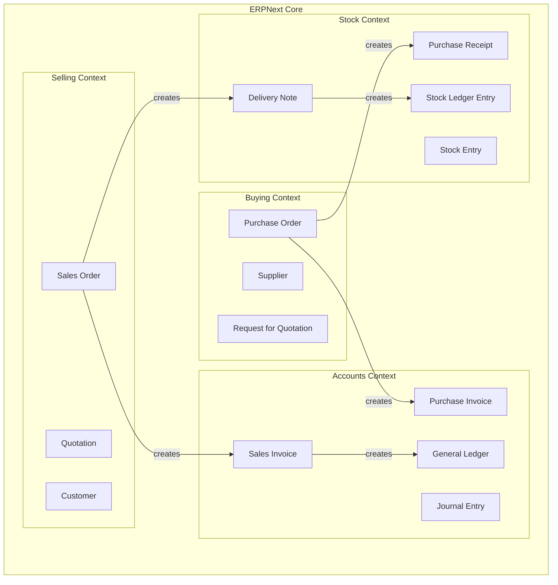
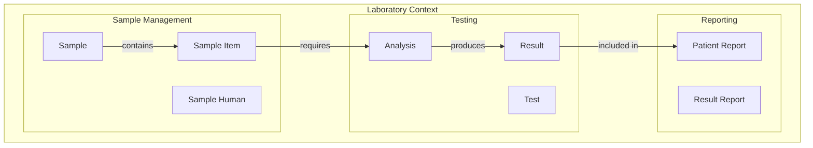
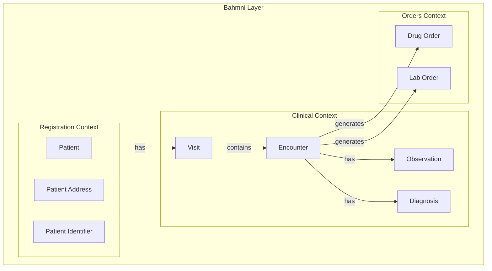
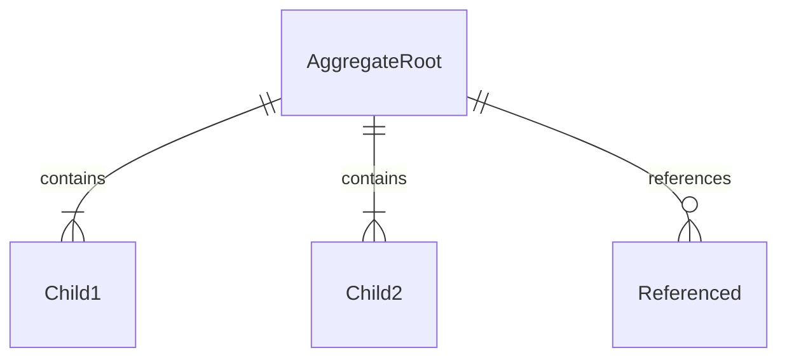

# DDD Applied to Target Projects

> **Theory meets practice**: Finding DDD patterns in ERPNext, OpenElis, and Bahmni

---

## Overview

Each target project has DDD patterns — they're just not always explicit.

```
┌─────────────────────────────────────────────────────────────────────────┐
│                    DDD IN THE WILD                                       │
├─────────────────────────────────────────────────────────────────────────┤
│                                                                          │
│  ERPNext/Frappe                                                         │
│  └── DocTypes = Entities with framework-managed persistence             │
│  └── Controllers = Domain Services                                      │
│  └── Events (hooks) = Domain Events                                     │
│  └── Bounded contexts by app (erpnext, hrms, etc.)                      │
│                                                                          │
│  OpenElis                                                               │
│  └── Traditional Java entities                                          │
│  └── DAOs = Repositories                                                │
│  └── Services = Domain Services                                         │
│  └── Clear bounded context: Laboratory                                  │
│                                                                          │
│  Bahmni/OpenMRS                                                         │
│  └── OpenMRS model = Healthcare entities                                │
│  └── Services with clear boundaries                                     │
│  └── Multiple bounded contexts (clinical, lab, pharmacy)                │
│                                                                          │
└─────────────────────────────────────────────────────────────────────────┘
```

---

## ERPNext: DDD Patterns

### Bounded Contexts

ERPNext has multiple apps, each a bounded context:



### Entities as DocTypes

```python
# ERPNext DocType = Entity
# File: erpnext/accounts/doctype/sales_invoice/sales_invoice.py

class SalesInvoice(SellingController):
    # Identity
    # name = primary key (auto-generated)

    # Attributes that change
    # status, outstanding_amount, paid_amount

    # Aggregate children
    # items = Sales Invoice Item (child table)
    # taxes = Sales Taxes and Charges (child table)
    # payments = Sales Invoice Payment (child table)

    def validate(self):
        # Business rules enforced here
        self.validate_posting_time()
        self.validate_items()
        self.set_amounts()

    def on_submit(self):
        # Domain events triggered
        self.make_gl_entries()  # Creates accounting entries
        self.update_stock()     # Updates inventory
```

### Aggregates in ERPNext

```python
# Sales Invoice is an Aggregate Root
# Children are: items, taxes, payments

class SalesInvoice:
    # Aggregate boundaries shown in DocType definition
    """
    {
        "doctype": "Sales Invoice",
        "fields": [
            {"fieldname": "customer", "fieldtype": "Link"},  # Reference by ID
            {"fieldname": "items", "fieldtype": "Table"}     # Children inside
        ]
    }
    """

    def add_item(self, item_code, qty, rate):
        # Changes go through root
        self.append("items", {
            "item_code": item_code,
            "qty": qty,
            "rate": rate
        })
        self.calculate_totals()  # Maintains consistency
```

### Domain Events (Hooks)

```python
# Frappe hooks = Domain Events
# File: erpnext/hooks.py

doc_events = {
    "Sales Invoice": {
        "on_submit": [
            "erpnext.accounts.doctype.sales_invoice.sales_invoice.make_gl_entries",
            "erpnext.stock.doctype.sales_invoice.update_stock_ledger",
        ],
        "on_cancel": [
            "erpnext.accounts.doctype.sales_invoice.reverse_gl_entries",
        ]
    }
}

# These are essentially event handlers:
# SalesInvoiceSubmitted → make_gl_entries
# SalesInvoiceSubmitted → update_stock_ledger
# SalesInvoiceCancelled → reverse_gl_entries
```

### Repositories (Implicit)

```python
# Frappe framework acts as repository
# You don't see "OrderRepository" — it's built into the framework

# Get by ID
invoice = frappe.get_doc("Sales Invoice", "INV-001")

# Query
invoices = frappe.get_all("Sales Invoice",
    filters={"customer": "CUST-001"},
    fields=["name", "grand_total", "status"]
)

# Save (entire aggregate)
invoice.save()  # Saves invoice + all children
```

### Your Task: ERPNext Analysis

When analyzing ERPNext, extract:

```json
{
  "bounded_context": "Accounts",
  "aggregates": [
    {
      "root": "Sales Invoice",
      "children": ["Sales Invoice Item", "Sales Taxes and Charges"],
      "references": ["Customer", "Item", "Cost Center"],
      "events": ["on_submit", "on_cancel"],
      "business_rules": [
        "Grand total must equal sum of items",
        "Posting date cannot be future",
        "Customer must exist"
      ]
    }
  ]
}
```

---

## OpenElis: DDD Patterns

### Bounded Context: Laboratory

OpenElis is a single bounded context (Laboratory):



### Entities

```java
// OpenElis Entity: Sample
// File: Sample.java

@Entity
@Table(name = "sample")
public class Sample {
    @Id  // Identity
    private String id;

    @Column(name = "accession_number")
    private String accessionNumber;  // Business identity

    @Column(name = "status_id")
    private String statusId;

    @Column(name = "collection_date")
    private Timestamp collectionDate;

    @OneToMany(mappedBy = "sample")  // Aggregate children
    private List<SampleItem> sampleItems;

    // Lifecycle
    public void receive() {
        this.statusId = "RECEIVED";
        this.receivedDate = new Timestamp(System.currentTimeMillis());
    }
}
```

### Value Objects (Often Missing)

```java
// OpenElis often uses primitives where Value Objects would be better
// Legacy pattern:
public class Sample {
    private String patientId;        // Should be PatientId value object
    private String organizationId;   // Should be OrganizationId
    private double amount;           // Should be Money or Quantity
    private String amountUnit;       // Part of Quantity value object
}

// What it SHOULD be (for modernization):
public class Sample {
    private PatientId patientId;
    private OrganizationId organizationId;
    private Quantity amount;  // amount + unit together
}
```

### Aggregates

```java
// Sample is Aggregate Root
// SampleItem is inside the aggregate

public class Sample {  // Root
    private List<SampleItem> sampleItems;

    public void addItem(Test test) {
        SampleItem item = new SampleItem();
        item.setTest(test);
        item.setSample(this);  // Reference back to root
        this.sampleItems.add(item);
    }

    // All items saved together with sample
}

// Analysis is a separate aggregate
public class Analysis {  // Different Root
    private String id;
    private String sampleItemId;  // Reference by ID, not object
    private List<Result> results;  // Children inside THIS aggregate
}
```

### Repositories (DAOs)

```java
// OpenElis uses DAO pattern = Repository
// File: SampleDAOImpl.java

public class SampleDAOImpl implements SampleDAO {

    public Sample getSampleById(String id) {
        return entityManager.find(Sample.class, id);
    }

    public Sample getSampleByAccessionNumber(String accessionNumber) {
        return entityManager
            .createQuery("SELECT s FROM Sample s WHERE s.accessionNumber = :an")
            .setParameter("an", accessionNumber)
            .getSingleResult();
    }

    public void save(Sample sample) {
        if (sample.getId() == null) {
            entityManager.persist(sample);
        } else {
            entityManager.merge(sample);
        }
    }
}
```

### Domain Services

```java
// OpenElis Service = Domain Service
// File: SampleService.java

public class SampleService {
    private SampleDAO sampleDAO;
    private AnalysisDAO analysisDAO;

    // Operation spanning multiple aggregates
    public void receiveSample(String sampleId) {
        Sample sample = sampleDAO.getSampleById(sampleId);
        sample.receive();

        // Create analyses for each test
        for (SampleItem item : sample.getSampleItems()) {
            Analysis analysis = new Analysis();
            analysis.setSampleItem(item);
            analysis.setTest(item.getTest());
            analysis.setStatus("PENDING");
            analysisDAO.save(analysis);
        }

        sampleDAO.save(sample);
    }
}
```

### Your Task: OpenElis Analysis

When analyzing OpenElis, extract:

```json
{
  "bounded_context": "Laboratory",
  "aggregates": [
    {
      "root": "Sample",
      "children": ["SampleItem", "SampleHuman", "SampleOrganization"],
      "references": ["Patient", "Organization", "Provider"],
      "lifecycle": ["created", "received", "in_progress", "completed"],
      "business_rules": [
        "Accession number must be unique",
        "Collection date required for human samples",
        "At least one test required"
      ]
    },
    {
      "root": "Analysis",
      "children": ["Result", "Note"],
      "references": ["SampleItem", "Test", "Analyzer"],
      "lifecycle": ["pending", "in_progress", "completed", "validated"]
    }
  ]
}
```

---

## Bahmni/OpenMRS: DDD Patterns

### Bounded Contexts

Bahmni extends OpenMRS with multiple contexts:



### Core Healthcare Entities

```java
// OpenMRS Entity: Patient (extends Person)
// This is a well-designed domain model

public class Patient extends Person {
    private Integer patientId;  // Identity

    // Value objects (implemented as separate entities in OpenMRS)
    private Set<PatientIdentifier> identifiers;  // MRN, national ID

    // Relationships
    private Set<Visit> visits;

    // Business methods
    public PatientIdentifier getPatientIdentifier(PatientIdentifierType type) {
        for (PatientIdentifier id : identifiers) {
            if (id.getIdentifierType().equals(type)) {
                return id;
            }
        }
        return null;
    }
}
```

### The Visit-Encounter Model

```java
// Visit = A period of care (aggregate root)
public class Visit {
    private Integer visitId;
    private Patient patient;           // Reference
    private VisitType visitType;       // OPD, IPD, Emergency
    private Date startDatetime;
    private Date stopDatetime;
    private Set<Encounter> encounters; // Children

    public void addEncounter(Encounter encounter) {
        encounter.setVisit(this);
        this.encounters.add(encounter);
    }

    public boolean isActive() {
        return stopDatetime == null;
    }
}

// Encounter = Single interaction (could be its own aggregate)
public class Encounter {
    private Integer encounterId;
    private Visit visit;               // Parent reference
    private EncounterType encounterType;
    private Set<Obs> obs;              // Observations
    private Set<Order> orders;         // Orders generated

    public void addObs(Obs observation) {
        observation.setEncounter(this);
        this.obs.add(observation);
    }
}
```

### Observation: Flexible Value Storage

```java
// Observation is interesting — stores ANY clinical data
public class Obs {
    private Integer obsId;
    private Concept concept;          // WHAT was measured (BP, Temp, etc.)

    // Flexible value storage — only one is populated
    private Double valueNumeric;      // 98.6
    private String valueText;         // "Patient reports headache"
    private Date valueDatetime;       // 2024-01-15
    private Concept valueCoded;       // Coded answer (Yes/No, Diagnosis)

    private Date obsDatetime;         // WHEN

    // This is essentially a key-value store with strong typing
    // concept_id determines which value field to use
}
```

### The Concept Dictionary

```java
// Concept = Medical term (VALUE OBJECT behavior, ENTITY implementation)
public class Concept {
    private Integer conceptId;
    private ConceptDatatype datatype;  // Numeric, Text, Coded, Date
    private ConceptClass conceptClass; // Diagnosis, Symptom, Test, Drug
    private Set<ConceptName> names;    // Translations
    private Set<ConceptAnswer> answers; // For coded concepts

    // Example concepts:
    // WEIGHT (Numeric, datatype=Numeric, class=Finding)
    // DIAGNOSIS (Coded, datatype=Coded, class=Diagnosis)
    // CHIEF_COMPLAINT (Text, datatype=Text, class=Question)
}
```

### Services

```java
// Bahmni Service = Domain Service
// File: BahmniPatientService.java

public interface BahmniPatientService {
    // Create patient (Factory pattern)
    Patient createPatient(BahmniPatient bahmniPatient);

    // Query methods (Repository-like)
    List<Patient> search(String identifier);
    List<Patient> searchSimilar(String name, String gender, Date birthDate);
}

// File: BahmniEncounterService.java
public interface BahmniEncounterService {
    // Transaction object pattern
    BahmniEncounterTransaction save(BahmniEncounterTransaction transaction);

    // This is interesting — they use a "transaction" object
    // to bundle all changes in a single clinical encounter
}
```

### EncounterTransaction: A Transaction Pattern

```java
// BahmniEncounterTransaction bundles all encounter data
// This is a clean pattern for complex saves

public class BahmniEncounterTransaction {
    private String patientUuid;
    private String visitUuid;
    private String encounterTypeUuid;

    // All observations in this encounter
    private List<BahmniObservation> observations;

    // All diagnoses made
    private List<BahmniDiagnosis> diagnoses;

    // All orders created
    private List<BahmniDrugOrder> drugOrders;
    private List<BahmniLabOrder> labOrders;

    // The service handles saving everything together
    // maintaining consistency across all these related entities
}
```

### Your Task: Bahmni Analysis

When analyzing Bahmni, extract:

```json
{
  "bounded_context": "Clinical",
  "aggregates": [
    {
      "root": "Visit",
      "children": ["Encounter"],
      "references": ["Patient", "VisitType", "Location"],
      "lifecycle": ["active", "completed"],
      "business_rules": [
        "Patient required",
        "Cannot add encounter to closed visit"
      ]
    },
    {
      "root": "Encounter",
      "children": ["Observation", "Diagnosis", "Order"],
      "references": ["Visit", "Provider", "EncounterType"],
      "business_rules": [
        "Provider required for clinical encounters",
        "Must belong to a visit"
      ]
    }
  ],
  "key_patterns": {
    "observation": "Flexible key-value storage using Concept dictionary",
    "encounter_transaction": "Bundle pattern for saving related data together"
  }
}
```

---

## Cross-Project Comparison

| Aspect | ERPNext | OpenElis | Bahmni |
|--------|---------|----------|--------|
| **Entity Style** | DocTypes | JPA Entities | OpenMRS Model |
| **Aggregate Pattern** | Parent-Child DocTypes | Entity + DAO | Visit-Encounter |
| **Event System** | Hooks (doc_events) | Manual/Service | OpenMRS Events |
| **Repository** | Framework (frappe.get_doc) | DAO classes | OpenMRS Services |
| **Value Objects** | Rare (Links, JSON) | Rare (primitives) | Partial (Concept) |
| **Context Boundaries** | By App | Single context | By module |

---

## What to Extract for Week-1

### Minimum Viable Analysis

```json
{
  "project": "your_choice",
  "focus_area": "one_bounded_context",
  "entities": [
    {
      "name": "EntityName",
      "identity": "id_field",
      "key_attributes": ["attr1", "attr2"],
      "relationships": [
        {"type": "contains", "target": "ChildEntity"},
        {"type": "references", "target": "OtherEntity"}
      ]
    }
  ],
  "aggregates": [
    {
      "root": "RootEntity",
      "children": ["Child1", "Child2"],
      "business_rules": ["rule1", "rule2"]
    }
  ],
  "domain_events": [
    {"name": "EntityCreated", "triggers": ["handler1", "handler2"]}
  ]
}
```

### Visualization (Mermaid)



---

## Key Takeaways

1. **DDD patterns exist** in all three projects — look for them
2. **Naming differs** — DocType, Entity, Model — but concepts are same
3. **Aggregates are visible** in parent-child relationships
4. **Events may be hidden** in hooks, callbacks, or service methods
5. **Value objects are often missing** — good modernization opportunity
6. **Extract what exists** first, then identify improvements

---

## Related

- [Strategic Design](./03-Strategic-Design.md)
- [Tactical Patterns](./04-Tactical-Patterns.md)
- [ERPNext Analysis](../04-Target-Projects/02-ERPNext-Domain-Analysis.md)
- [OpenElis Analysis](../04-Target-Projects/03-OpenElis-Domain-Analysis.md)
- [Bahmni Analysis](../04-Target-Projects/04-Bahmni-Core-Domain-Analysis.md)
