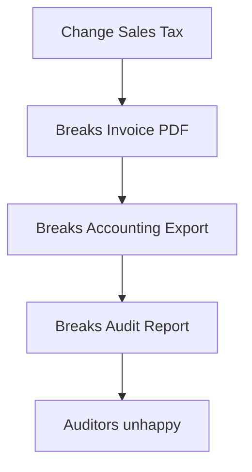

# What Is Legacy Code?

> **The reality**: Legacy code is not bad code. It's code that makes money.

---

## Definition

**Legacy code** is software that:

1. Has been in production for years (often 5-20+ years)
2. Is critical to business operations
3. Is difficult to change safely
4. Contains embedded business knowledge that may not exist anywhere else

```
┌─────────────────────────────────────────────────────────────────────────┐
│                         THE LEGACY PARADOX                               │
├─────────────────────────────────────────────────────────────────────────┤
│                                                                          │
│  Legacy systems are simultaneously:                                      │
│                                                                          │
│  ✓ The most VALUABLE software (proven, running, making money)           │
│  ✓ The most DIFFICULT software (hard to understand, change, test)       │
│  ✓ The most RISKY software (change one thing, break something else)     │
│                                                                          │
└─────────────────────────────────────────────────────────────────────────┘
```

---

## Why Does Legacy Code Exist?

Legacy code isn't created by bad developers. It emerges from:

### 1. Success

The software worked! It solved real problems. It survived while other projects died. Its very existence proves it delivered value.

### 2. Time

Technologies change. What was cutting-edge in 2005 (Java EE, Struts, jQuery) is now "legacy." The code didn't get worse—the world moved on.

### 3. Evolution

Business requirements changed. Features were added. Edge cases were handled. Each change was rational at the time. The accumulation creates complexity.

### 4. Knowledge Loss

Original developers left. Documentation wasn't maintained. Tribal knowledge was lost. Now nobody fully understands how it works.

---

## Characteristics of Legacy Systems

### Technical Indicators

| Indicator | Description |
|-----------|-------------|
| **Old tech stack** | Java 6, Python 2, PHP 5, jQuery, AngularJS 1.x |
| **Monolithic architecture** | Everything in one deployable unit |
| **Shared database** | Many applications hitting the same DB |
| **Minimal tests** | Little to no automated test coverage |
| **Documentation gaps** | Outdated or missing docs |
| **Build complexity** | "Only John knows how to deploy it" |

### Business Indicators

| Indicator | Description |
|-----------|-------------|
| **Still making money** | Critical to daily operations |
| **Fear of change** | "Don't touch that code" culture |
| **High maintenance cost** | Lots of time fixing bugs |
| **Slow feature delivery** | Simple changes take weeks |
| **Knowledge silos** | Only certain people can work on it |

---

## The Hidden Value in Legacy Code

Legacy code contains something invaluable: **encoded business knowledge**.

```
┌─────────────────────────────────────────────────────────────────────────┐
│                    WHERE BUSINESS LOGIC LIVES                            │
├─────────────────────────────────────────────────────────────────────────┤
│                                                                          │
│  In Documentation:     5%   │░                                          │
│  In People's Heads:   10%   │░░                                         │
│  In THE CODE:         85%   │░░░░░░░░░░░░░░░░░                          │
│                                                                          │
│  That weird if-statement? It handles a real edge case.                  │
│  That complex calculation? It's the actual business rule.               │
│  That commented-out code? Someone tried and failed.                     │
│                                                                          │
└─────────────────────────────────────────────────────────────────────────┘
```

### Examples of Hidden Knowledge

**That weird date check:**
```python
# Why January 15th? Because that's when fiscal year reports are due
# and we need special handling for late submissions
if posting_date.month == 1 and posting_date.day > 15:
    apply_late_fee()
```

**That complex discount logic:**
```python
# Handles loyalty program rules that evolved over 8 years
# DO NOT SIMPLIFY - these edge cases are real customer scenarios
if customer.tier == 'gold' and order.total > 500:
    if customer.registration_date < datetime(2018, 1, 1):
        discount = 0.15  # Legacy gold members get better rate
    else:
        discount = 0.10
```

---

## Why Legacy Modernization Is Hard

### 1. You Can't Just Rewrite

```
┌─────────────────────────────────────────────────────────────────────────┐
│                    THE REWRITE FALLACY                                   │
├─────────────────────────────────────────────────────────────────────────┤
│                                                                          │
│  Plan:    "Let's rewrite it from scratch, it'll be cleaner!"            │
│                                                                          │
│  Reality:                                                                │
│  • Takes 2-3x longer than estimated                                     │
│  • Misses edge cases the old system handled                             │
│  • Business can't wait—they need features NOW                           │
│  • Old system keeps changing while you rewrite                          │
│  • 70% of rewrites fail or are abandoned                                │
│                                                                          │
│  Better approach: Incremental modernization (Strangler Fig Pattern)     │
│                                                                          │
└─────────────────────────────────────────────────────────────────────────┘
```

### 2. The Knowledge Is In The Code

```
Original Developer: "Why does this code exist?"
(retired 2019)

Current Developer: "I have no idea, but if we remove it,
                    orders from France fail"

The Code: *silently handling a VAT edge case from 2012*
```

### 3. Everything Is Connected

Change one thing, break something else. In a monolith:



---

## What This Means For You

As someone building **code intelligence tools**, your job is to help humans understand legacy systems.

### Your Tools Should Answer:

| Question | What You Extract |
|----------|------------------|
| "What does this code do?" | Function/class summaries |
| "What calls this function?" | Call graphs |
| "What would break if I change this?" | Impact analysis |
| "Where is the discount logic?" | Semantic search |
| "What are the business rules here?" | Validation/calculation extraction |

### Why This Matters

Every enterprise has legacy systems. The $300B+ legacy modernization market exists because:

1. Companies can't abandon working systems
2. They can't afford to understand them manually
3. AI can help extract and preserve knowledge
4. Tools like what you're building are desperately needed

---

## The Opportunity

```
┌─────────────────────────────────────────────────────────────────────────┐
│                      WHY THIS INTERNSHIP MATTERS                         │
├─────────────────────────────────────────────────────────────────────────┤
│                                                                          │
│  Legacy modernization is one of the hardest problems in software.       │
│                                                                          │
│  Current solutions:                                                      │
│  • Manual code reading (slow, expensive, error-prone)                   │
│  • Traditional static analysis (misses business context)                │
│  • Full rewrites (high failure rate)                                    │
│                                                                          │
│  What's needed:                                                          │
│  • AI-powered understanding (what you're building)                      │
│  • Semantic code search (beyond keyword matching)                       │
│  • Knowledge extraction (turn code into documentation)                  │
│  • Safe migration tooling (preserve business behavior)                  │
│                                                                          │
│  You're learning to build tools that solve a $300B problem.            │
│                                                                          │
└─────────────────────────────────────────────────────────────────────────┘
```

---

## Key Takeaways

1. **Legacy ≠ Bad**: Legacy code is valuable, proven software
2. **The knowledge is in the code**: Not in docs, not in people's heads
3. **Rewrites fail**: Incremental modernization is the way
4. **AI can help**: Extract, understand, and preserve business logic
5. **You're solving a real problem**: Every enterprise needs this

---

## Related

- [Why Modernize Legacy Systems?](./02-Why-Modernize.md)
- [Terminology Glossary](./04-Terminology-Glossary.md)
- [Real-World Legacy Examples](./03-Real-World-Examples.md)
- [Why DDD Matters for Modernization](../05-DDD-Concepts/01-Why-DDD-Matters.md)
