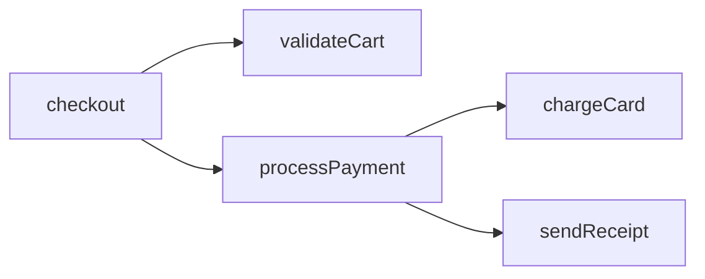

# Terminology Glossary

> **Quick Reference**: Terms you'll encounter during this internship

---

## Core Concepts

### Legacy System

A software system that has been in production for years (often 10-20+), typically built with older technologies, but still critical to business operations.

**Characteristics:**
- Still running in production
- Hard to modify without breaking things
- Often poorly documented
- Contains embedded business knowledge

**Example**: A Java application from 2008 that processes millions of dollars in transactions daily.

---

### Modernization

The process of updating legacy systems to use modern technologies, architectures, and practices—without losing the business value they provide.

**NOT the same as:**
- Rewriting from scratch (too risky)
- Lift-and-shift to cloud (doesn't fix underlying issues)

---

### Technical Debt

The accumulated cost of shortcuts, quick fixes, and deferred maintenance in a codebase. Like financial debt, it accrues "interest" over time.

**Examples:**
- Copy-pasted code instead of proper abstractions
- Hardcoded values instead of configuration
- Missing tests
- Outdated dependencies

---

### Code Intelligence

Tools and techniques for automatically understanding codebases—extracting structure, relationships, and meaning from source code.

**What it enables:**
- "Find all functions that touch the Order table"
- "Show me the call graph for checkout"
- "What would break if I change this?"

---

## Architecture Patterns

### Monolith

A single deployable unit containing all application functionality. Everything runs in one process.

```
┌─────────────────────────────────────┐
│            MONOLITH                 │
│                                     │
│  ┌─────┐ ┌─────┐ ┌─────┐ ┌─────┐  │
│  │Sales│ │Inv. │ │ HR  │ │Acct │  │
│  └─────┘ └─────┘ └─────┘ └─────┘  │
│                                     │
│         Shared Database             │
└─────────────────────────────────────┘
```

**Pros:** Simple to deploy, no network overhead
**Cons:** Hard to scale, change one thing affects everything

---

### Microservices

Application split into small, independently deployable services, each owning its data.

```
┌─────────┐   ┌─────────┐   ┌─────────┐
│  Sales  │   │Inventory│   │ Accounts│
│ Service │   │ Service │   │ Service │
│   DB    │   │   DB    │   │   DB    │
└─────────┘   └─────────┘   └─────────┘
```

**Pros:** Independent scaling, isolated failures
**Cons:** Network complexity, distributed transactions

---

### Bounded Context

A boundary within which a particular domain model is defined and applicable. Different contexts can use the same term with different meanings.

**Example:**
- "Customer" in Sales = someone who buys
- "Customer" in Support = someone with a ticket
- Same word, different models

---

### Strangler Fig Pattern

Incrementally replacing a legacy system by routing traffic to new services while the old system still runs.

```
Before:     All traffic → Legacy System

During:     Traffic → Router → Legacy (most)
                            → New Service (some)

After:      All traffic → New Services
            Legacy retired
```

Named after strangler fig trees that grow around and eventually replace their host.

---

## Code Analysis Terms

### AST (Abstract Syntax Tree)

A tree representation of source code structure. Used by compilers, linters, and code intelligence tools.

```
Code: function add(a, b) { return a + b; }

AST:
FunctionDeclaration
├── name: "add"
├── params: ["a", "b"]
└── body: ReturnStatement
    └── BinaryExpression (a + b)
```

---

### Tree-sitter

A parser generator tool that creates fast, incremental parsers for programming languages. Used for syntax highlighting and code analysis.

**Why it matters:**
- Handles incomplete/broken code
- Very fast (used in editors)
- Supports 50+ languages

---

### Call Graph

A diagram showing which functions/methods call which other functions/methods.



---

### Embedding

A numerical vector representation of text (or code) that captures semantic meaning. Similar meanings = similar vectors.

**Example:**
```
"calculate total" → [0.2, -0.5, 0.8, ...]
"compute sum"     → [0.21, -0.48, 0.79, ...]  # Similar!
"send email"      → [-0.3, 0.7, 0.1, ...]     # Different
```

---

### RAG (Retrieval-Augmented Generation)

A technique that enhances LLM responses by first retrieving relevant context from a knowledge base.

```
Query: "How does discount work?"
  ↓
1. Search vector DB for relevant code
  ↓
2. Retrieve: DiscountService.py, pricing_rules.py
  ↓
3. Send to LLM with context
  ↓
4. LLM generates informed answer
```

---

## Domain-Driven Design (DDD) Terms

### Domain

The subject area or business problem your software addresses.

**Examples:**
- E-commerce domain: orders, products, customers, payments
- Healthcare domain: patients, encounters, diagnoses, treatments

---

### Entity

An object defined by its identity, not its attributes. Two entities with the same attributes but different IDs are different.

**Example:** Two `Customer` objects with different IDs are different customers, even if they have the same name.

---

### Value Object

An object defined by its attributes, not identity. Two value objects with the same attributes are equal.

**Example:** `Money(100, "USD")` = `Money(100, "USD")` regardless of where they came from.

---

### Aggregate

A cluster of entities and value objects treated as a unit. Has a root entity (aggregate root) that controls access.

```
Order (Aggregate Root)
├── OrderLine (Entity)
├── OrderLine (Entity)
└── ShippingAddress (Value Object)
```

---

### Repository

An abstraction for data access. Provides collection-like interface for aggregates.

```python
# Instead of SQL everywhere:
order = order_repository.find_by_id(123)
order_repository.save(order)
```

---

## ERP/Business Terms

### ERP (Enterprise Resource Planning)

Software that integrates core business processes: accounting, inventory, HR, manufacturing, etc.

**Examples:** SAP, Oracle, ERPNext, Odoo

---

### DocType (Frappe/ERPNext specific)

A document type in the Frappe framework. Defines an entity with its fields, relationships, and behaviors.

```
DocType: Sales Invoice
├── Schema: sales_invoice.json
├── Logic: sales_invoice.py
└── UI: sales_invoice.js
```

---

### General Ledger (GL)

The master accounting record containing all financial transactions.

**Related terms:**
- Journal Entry: A single accounting transaction
- Chart of Accounts: List of all accounts
- Double-entry: Every transaction has debit and credit

---

## Healthcare Terms (For Bahmni/OpenElis)

### EMR (Electronic Medical Record)

Digital version of a patient's paper chart. Contains medical history, diagnoses, medications, etc.

---

### Encounter

A single interaction between patient and healthcare provider (visit, consultation, etc.).

---

### Observation

A clinical measurement or finding (blood pressure, temperature, symptoms).

---

### LIMS (Laboratory Information Management System)

Software for managing lab samples, tests, and results. OpenElis is a LIMS.

---

## Modernization Patterns

### Anti-Corruption Layer (ACL)

A translation layer that prevents legacy system concepts from "corrupting" your new system's model.

```
New System ──→ ACL ──→ Legacy System
              │
              └── Translates between models
```

---

### Feature Parity

Ensuring a new system does everything the old system did. Critical for migrations.

**Tracking:**
- Legacy Feature A → Modern Equivalent ✅
- Legacy Feature B → Modern Equivalent ✅
- Legacy Feature C → Not implemented yet ❌

---

### Parity Tracking

The process of mapping legacy features to modern implementations and tracking migration progress.

---

## AI/ML Terms

### LLM (Large Language Model)

AI models trained on vast text data that can generate human-like text. Examples: GPT-4, Claude, Llama.

---

### Vector Database

A database optimized for storing and searching embedding vectors. Enables semantic search.

**Examples:** LanceDB, Pinecone, ChromaDB

---

### Semantic Search

Finding content by meaning rather than exact keywords.

**Keyword search:** "calculate total" only finds "calculate total"
**Semantic search:** "calculate total" also finds "compute sum", "get amount"

---

### Chunking

Splitting large documents/code into smaller pieces for processing and embedding.

**Strategies:**
- Fixed size (every 500 tokens)
- Semantic (by function/class boundaries)
- Sliding window (overlapping chunks)

---

## Related

- [What Is Legacy Code?](./01-What-Is-Legacy.md)
- [Why Modernize?](./02-Why-Modernize.md)
- [Why DDD Matters](../05-DDD-Concepts/01-Why-DDD-Matters.md)
