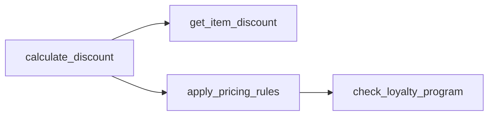

# Context Generation

## Purpose

Transform extracted code knowledge into structured context that AI assistants can use to answer questions accurately.

---

## The Context Generation Pipeline

```
┌─────────────────────────────────────────────────────────────────────────┐
│  CONTEXT GENERATION PIPELINE                                             │
├─────────────────────────────────────────────────────────────────────────┤
│                                                                          │
│  1. QUERY UNDERSTANDING                                                  │
│     ├── Parse user question                                             │
│     ├── Identify intent (workflow? entity? rule?)                       │
│     └── Extract key entities/concepts                                   │
│                                                                          │
│  2. RETRIEVAL                                                            │
│     ├── Semantic search (embeddings)                                    │
│     ├── Keyword search (BM25)                                           │
│     ├── Graph traversal (relationships)                                 │
│     └── Hybrid merge + reranking                                        │
│                                                                          │
│  3. CONTEXT ASSEMBLY                                                     │
│     ├── Select relevant chunks                                          │
│     ├── Order by relevance                                              │
│     ├── Add relationship context                                        │
│     └── Fit within token budget                                         │
│                                                                          │
│  4. FORMATTING                                                           │
│     ├── Structure for LLM consumption                                   │
│     ├── Add metadata (file, line, type)                                 │
│     └── Include visualization (Mermaid)                                 │
│                                                                          │
└─────────────────────────────────────────────────────────────────────────┘
```

---

## Context Types

### Structural Context

What exists in the codebase:

```json
{
  "type": "structural",
  "entities": [
    {
      "name": "SalesInvoice",
      "type": "class",
      "file": "sales_invoice.py",
      "methods": ["validate", "on_submit", "on_cancel"],
      "relationships": ["Customer", "Item", "GLEntry"]
    }
  ]
}
```

### Semantic Context

What the code means:

```json
{
  "type": "semantic",
  "business_rules": [
    {
      "rule": "Discount cannot exceed 50% without manager approval",
      "location": "sales_invoice.py:145",
      "confidence": 0.85
    }
  ],
  "workflows": [
    {
      "trigger": "on_submit",
      "steps": ["validate", "create_gl_entry", "update_stock", "send_notification"]
    }
  ]
}
```

### Operational Context

How the code runs:

```json
{
  "type": "operational",
  "entry_points": ["SalesInvoiceController.create", "SalesInvoiceController.submit"],
  "side_effects": ["writes to GL Entry", "updates Stock Ledger"],
  "external_calls": ["PaymentGateway.charge", "EmailService.send"]
}
```

---

## Query-Aware Retrieval

Different questions need different context:

| Query Type | Primary Source | Secondary Source |
|------------|----------------|------------------|
| "What is X?" | Entity extraction | Related entities |
| "How does X work?" | Workflow traces | Call graphs |
| "What calls X?" | Dependency graph | Usage examples |
| "What validates X?" | Business rules | Test cases |
| "What happens when X?" | Event handlers | Side effects |

### Example: "How does discount calculation work?"

```python
# Step 1: Identify intent
intent = "workflow"  # "how does X work" = workflow query

# Step 2: Find entry points
entry_points = search("discount calculation", type="function")
# → ["calculate_discount", "apply_pricing_rules", "get_item_discount"]

# Step 3: Build context
context = {
    "primary": get_function_content("calculate_discount"),
    "callers": get_callers("calculate_discount"),
    "callees": get_callees("calculate_discount"),
    "business_rules": extract_rules("calculate_discount"),
    "diagram": build_call_graph("calculate_discount", depth=3)
}
```

---

## Token Budget Management

LLMs have token limits. Context must fit:

| Model | Context Window | Safe Budget |
|-------|----------------|-------------|
| GPT-4 | 8K / 32K / 128K | 6K / 24K / 100K |
| Claude | 100K / 200K | 80K / 160K |
| Llama 3 | 8K | 6K |

### Strategies

1. **Prioritization**: Most relevant first
2. **Summarization**: Compress less relevant context
3. **Truncation**: Cut lowest relevance items
4. **Reference**: Link to full content, include summary

```python
def fit_context(chunks: list, budget: int) -> list:
    """Select chunks that fit within token budget."""
    result = []
    tokens_used = 0

    for chunk in sorted(chunks, key=lambda c: c.relevance, reverse=True):
        if tokens_used + chunk.tokens <= budget:
            result.append(chunk)
            tokens_used += chunk.tokens
        else:
            # Add summary instead of full content
            summary = summarize(chunk)
            if tokens_used + summary.tokens <= budget:
                result.append(summary)
                tokens_used += summary.tokens

    return result
```

---

## Output Formats

### For MCP Tools

```typescript
interface ContextResponse {
  context: string;           // Formatted for LLM
  metadata: {
    files: string[];         // Source files
    confidence: number;      // 0-1
    token_count: number;
  };
  visualizations?: {
    call_graph?: string;     // Mermaid diagram
    entity_map?: string;     // Mermaid diagram
  };
}
```

### For Direct LLM Use

```markdown
## Context: Discount Calculation in ERPNext

### Entry Point
`erpnext/accounts/doctype/sales_invoice/sales_invoice.py:calculate_discount()`

### Business Rules
- Discount cannot exceed item max_discount field
- Loyalty discount applies after item discount
- Manager approval required for >50% discount

### Call Flow


### Related Code
[Code snippets here...]
```

---

## Quality Signals

Track these to improve context quality:

| Signal | Indicates | Action |
|--------|-----------|--------|
| LLM ignores context | Irrelevant context | Improve retrieval |
| LLM asks for more | Incomplete context | Expand graph traversal |
| LLM contradicts context | Outdated/wrong context | Verify extraction |
| User corrects answer | Missing business rules | Add manual annotations |

---

## Related

- [[02-LLM-Integration|LLM Integration Patterns]]
- [[03-Observability|Observability & Experiments]]
- [[04-Quality-Metrics|Quality Metrics]]
- [[../02-Engineering/01-Architecture|4-Mode Architecture]]

---

*Last Updated: 2026-01-13*
