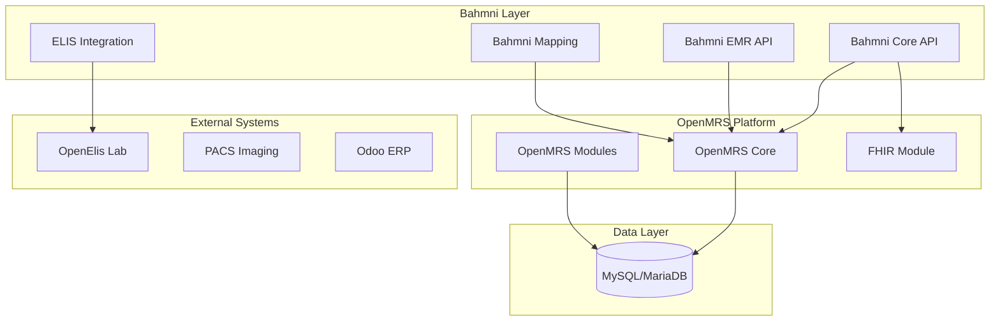
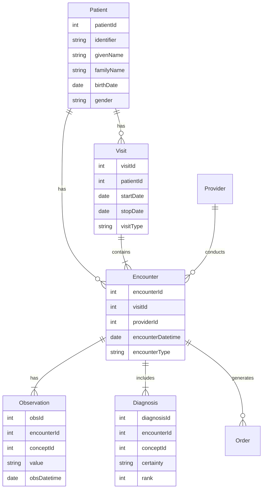
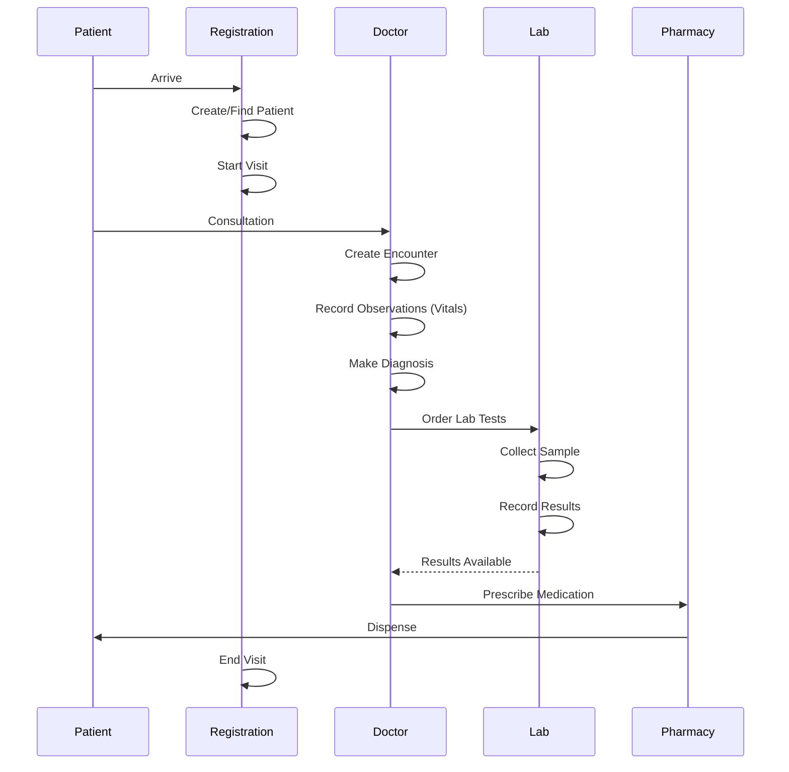

# Bahmni-Core Domain Analysis

> **Healthcare EMR**: Patient management, clinical encounters, and medical observations

---

## Overview

| Attribute | Value |
|-----------|-------|
| **Repository** | [github.com/Bahmni/bahmni-core](https://github.com/Bahmni/bahmni-core) |
| **Language** | Java 94% |
| **Domain** | Electronic Medical Records (EMR) |
| **Platform** | OpenMRS (extends) |
| **Size** | ~800 Java files |
| **License** | AGPL 3.0 |

Bahmni is a **hospital management system** built on OpenMRS (open-source medical records). It adds clinical workflows, lab integration, and reporting to the core platform.

---

## Architecture Overview



---

## Domain Model

### Core Healthcare Entities



---

## Key Concepts

### 1. Patient

The central entity. A person receiving care.

```java
// Key attributes
Patient {
    PersonName[] names;           // Can have multiple names
    PatientIdentifier[] ids;      // MRN, national ID, etc.
    PersonAddress[] addresses;
    Set<Encounter> encounters;
    Set<Visit> visits;
}
```

### 2. Visit

A continuous period of care (e.g., a hospital stay).

```java
Visit {
    Patient patient;
    Date startDatetime;
    Date stopDatetime;
    VisitType visitType;         // OPD, IPD, Emergency
    Set<Encounter> encounters;
}
```

### 3. Encounter

A single interaction (consultation, lab, procedure).

```java
Encounter {
    Visit visit;
    Patient patient;
    Provider provider;
    EncounterType encounterType;  // Consultation, Lab, Admission
    Set<Observation> obs;
    Set<Order> orders;
}
```

### 4. Observation

A clinical finding (vitals, symptoms, test results).

```java
Observation {
    Encounter encounter;
    Concept concept;              // What was measured (BP, Temp, etc.)
    String valueText;             // Or valueNumeric, valueDatetime, etc.
    Date obsDatetime;
}
```

### 5. Concept

A medical concept from a terminology (SNOMED, ICD, custom).

```java
Concept {
    String name;
    ConceptDatatype datatype;     // Numeric, Text, Coded, etc.
    ConceptClass conceptClass;    // Diagnosis, Symptom, Test, etc.
    Set<ConceptAnswer> answers;   // For coded concepts
}
```

---

## Clinical Workflow



---

## Module Structure

```
bahmni-core/
├── bahmnicore-api/           ← Core API services
│   └── src/main/java/org/bahmni/module/bahmnicore/
│       ├── service/          ← Business services
│       ├── dao/              ← Data access
│       └── contract/         ← DTOs
├── bahmnicore-omod/          ← OpenMRS module wrapper
├── bahmni-emr-api/           ← EMR-specific services
│   └── src/main/java/org/openmrs/module/bahmniemrapi/
│       ├── encountertransaction/  ← Encounter handling
│       ├── diagnosis/            ← Diagnosis services
│       └── document/             ← Document management
├── openmrs-elis-atomfeed-client-omod/  ← Lab integration
├── obs-relation/             ← Observation relationships
└── admin/                    ← Administrative functions
```

---

## Key Services to Analyze

### BahmniPatientService

```java
public interface BahmniPatientService {
    Patient createPatient(BahmniPatient bahmniPatient);
    List<Patient> search(String identifier);
    List<Patient> searchSimilar(String name, String gender, Date birthDate);
}
```

### BahmniEncounterService

```java
public interface BahmniEncounterService {
    BahmniEncounterTransaction save(BahmniEncounterTransaction encounterTransaction);
    BahmniEncounterTransaction find(String patientUuid, String encounterUuid);
    List<BahmniEncounterTransaction> find(PatientSearchParameters params);
}
```

### BahmniDiagnosisService

```java
public interface BahmniDiagnosisService {
    void save(List<BahmniDiagnosis> diagnoses, Encounter encounter);
    List<BahmniDiagnosis> getDiagnoses(String patientUuid);
}
```

---

## Business Rules Examples

### Patient Registration Rules

```java
// Rule: Patient must have at least one identifier
if (patient.getIdentifiers().isEmpty()) {
    throw new ValidationException("Patient must have an identifier");
}

// Rule: Birth date cannot be in the future
if (patient.getBirthdate().after(new Date())) {
    throw new ValidationException("Birth date cannot be in future");
}
```

### Encounter Rules

```java
// Rule: Encounter must belong to active visit
if (!visit.isActive()) {
    throw new ValidationException("Cannot add encounter to closed visit");
}

// Rule: Provider required for clinical encounters
if (encounter.getProvider() == null && isClinicalEncounterType(encounter)) {
    throw new ValidationException("Provider required for clinical encounter");
}
```

### Observation Rules

```java
// Rule: Numeric observations must be within valid range
Concept concept = obs.getConcept();
if (concept.isNumeric()) {
    Double value = obs.getValueNumeric();
    ConceptNumeric cn = (ConceptNumeric) concept;
    if (value < cn.getLowAbsolute() || value > cn.getHiAbsolute()) {
        throw new ValidationException("Value out of range");
    }
}
```

---

## Complexity Factors

### Why Bahmni Is More Challenging

1. **Platform Dependency**
   - Extends OpenMRS (need to understand platform too)
   - Many base classes and interfaces from OpenMRS

2. **Medical Domain**
   - Concept dictionary (thousands of medical terms)
   - Complex data types (coded, numeric, text)
   - Regulatory requirements

3. **Integration Heavy**
   - Atom feeds to/from Lab
   - FHIR for interoperability
   - External ERP systems

---

## Suggested Week-1 Focus

### Target: Patient Registration Flow

**Files to analyze:**

```
bahmni-core/bahmnicore-api/src/main/java/org/bahmni/module/bahmnicore/
├── service/impl/BahmniPatientServiceImpl.java
├── dao/impl/BahmniPatientDaoImpl.java
└── contract/patient/BahmniPatient.java
```

### What to Extract

1. **Patient Entity**
   - Fields from BahmniPatient contract
   - Relationships (identifiers, addresses, names)

2. **Registration Flow**
   - Create patient
   - Search patient
   - Update patient

3. **Validation Rules**
   - Required fields
   - Business constraints

### Expected Output

```json
{
  "entity": "BahmniPatient",
  "fields": [
    {"name": "uuid", "type": "String", "required": false},
    {"name": "identifiers", "type": "List<PatientIdentifier>", "required": true},
    {"name": "names", "type": "List<PersonName>", "required": true},
    {"name": "gender", "type": "String", "required": true},
    {"name": "birthdate", "type": "Date", "required": false}
  ],
  "operations": [
    "createPatient",
    "searchByIdentifier",
    "searchSimilar",
    "updatePatient"
  ],
  "validationRules": [
    "At least one identifier required",
    "At least one name required",
    "Gender must be M/F",
    "Birthdate cannot be future"
  ]
}
```

---

## Resources

- [Bahmni Wiki](https://bahmni.atlassian.net/wiki/)
- [OpenMRS Developer Guide](https://wiki.openmrs.org/display/docs/Developer+Guide)
- [Bahmni GitHub](https://github.com/Bahmni)

---

## Related

- [Choosing Your Project](./01-Choosing-Your-Project.md)
- [ERPNext Analysis](./02-ERPNext-Domain-Analysis.md)
- [OpenElis Analysis](./03-OpenElis-Domain-Analysis.md)
- [Week 1 Requirements](../08-Exercises/01-Pre-Internship-Requirements.md)
