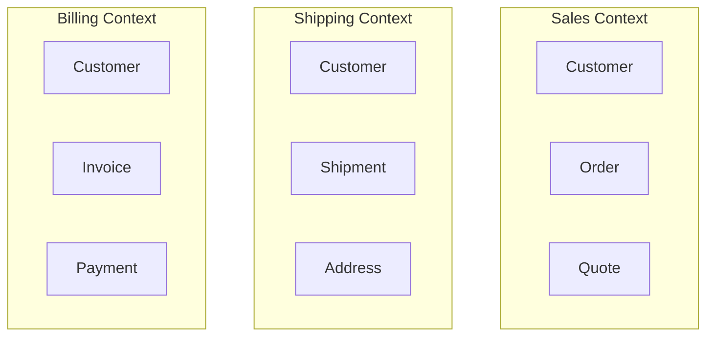

# Why DDD Matters for Modernization

> **The insight**: DDD isn't about code patterns. It's about understanding the business.

---

## What Is Domain-Driven Design?

**Domain-Driven Design (DDD)** is an approach to software development that:

1. Focuses on the **core business domain**
2. Creates a **shared language** between developers and business experts
3. Structures code to **reflect business reality**
4. Defines **boundaries** between different parts of the system

```
┌─────────────────────────────────────────────────────────────────────────┐
│                         DDD IN ONE SENTENCE                              │
├─────────────────────────────────────────────────────────────────────────┤
│                                                                          │
│  "Software should speak the language of the business it serves."        │
│                                                                          │
└─────────────────────────────────────────────────────────────────────────┘
```

---

## Why Should AI Tool Builders Care?

You might think: "I'm building code intelligence tools, not business applications. Why do I need DDD?"

Here's why:

### 1. You Need to Understand What You're Analyzing

Your tool will analyze **enterprise business systems**. These systems model:
- Sales processes
- Inventory management
- Healthcare workflows
- Financial transactions

If you don't understand domains, you can't build tools that understand them.

### 2. Bounded Contexts = Migration Units

When modernizing, you need to answer: "What can I migrate independently?"

DDD's **bounded contexts** answer this. They're natural boundaries for:
- Microservice extraction
- Team ownership
- Independent deployment

Your AI tool should **discover** these boundaries.

### 3. The Language Problem

```
┌─────────────────────────────────────────────────────────────────────────┐
│                    THE SAME WORD, DIFFERENT MEANINGS                     │
├─────────────────────────────────────────────────────────────────────────┤
│                                                                          │
│  "Customer" in Sales:    Someone who buys products                      │
│  "Customer" in Support:  Someone who filed a ticket                     │
│  "Customer" in Billing:  Someone who owes money                         │
│                                                                          │
│  Same word. Different data. Different behaviors. Different code.        │
│                                                                          │
│  DDD calls this: Bounded Contexts with Ubiquitous Language              │
│  Your tool needs to: Identify which "Customer" is which                 │
│                                                                          │
└─────────────────────────────────────────────────────────────────────────┘
```

---

## Core DDD Concepts

### 1. Domain

The **subject area** your software addresses. The business problem being solved.

**Examples:**
- E-commerce domain: Products, orders, customers, payments
- Healthcare domain: Patients, encounters, diagnoses, treatments
- ERP domain: Accounting, inventory, HR, manufacturing

### 2. Ubiquitous Language

A **shared vocabulary** used by everyone (developers, business experts, documentation, code).

**Bad:**
```python
# Developer's language (unclear)
def process_transaction(data):
    if data.status == 3:  # What is 3?
        update_record(data.ref)  # What record?
```

**Good (with Ubiquitous Language):**
```python
# Business language (clear)
def approve_purchase_order(order: PurchaseOrder):
    if order.status == OrderStatus.PENDING_APPROVAL:
        order.approve()
```

### 3. Bounded Context

A **boundary** within which a particular domain model is defined and applicable.



**Key insight**: Each context has its **own** Customer model. They share the name but have different attributes and behaviors.

### 4. Context Map

A **diagram** showing how bounded contexts relate to each other.

```
┌─────────────────────────────────────────────────────────────────────────┐
│                         CONTEXT MAP EXAMPLE                              │
├─────────────────────────────────────────────────────────────────────────┤
│                                                                          │
│  ┌─────────────┐                           ┌─────────────┐              │
│  │   Sales     │                           │  Shipping   │              │
│  │   Context   │ ────── Customer/Ship ──── │   Context   │              │
│  └─────────────┘                           └─────────────┘              │
│        │                                          │                      │
│        │                                          │                      │
│        │ Downstream                    Downstream │                      │
│        │                                          │                      │
│        ▼                                          ▼                      │
│  ┌─────────────────────────────────────────────────────┐                │
│  │                  Billing Context                     │                │
│  │            (Receives data from both)                 │                │
│  └─────────────────────────────────────────────────────┘                │
│                                                                          │
└─────────────────────────────────────────────────────────────────────────┘
```

---

## DDD for Code Intelligence Tools

### What Your Tool Should Detect

| DDD Concept | How to Detect | Why It Matters |
|-------------|---------------|----------------|
| **Entities** | Classes with IDs, database models | Core business objects |
| **Value Objects** | Immutable classes, no ID | Domain values (Money, Address) |
| **Aggregates** | Root entities with child collections | Transaction boundaries |
| **Repositories** | Data access classes, DAOs | Persistence layer |
| **Services** | Business logic classes | Domain operations |
| **Bounded Contexts** | Module boundaries, separate databases | Migration units |

### Example: Detecting Bounded Contexts

In ERPNext, bounded contexts are visible as **apps/modules**:

```
erpnext/
├── accounts/      ← Accounting Context
│   └── doctype/
│       ├── sales_invoice/
│       └── payment_entry/
├── selling/       ← Sales Context
│   └── doctype/
│       ├── customer/
│       └── sales_order/
├── stock/         ← Inventory Context
│   └── doctype/
│       ├── item/
│       └── warehouse/
```

Your tool should:
1. **Identify** these boundaries
2. **Map** relationships between them
3. **Analyze** dependencies (which contexts depend on which)

---

## Why Legacy Systems Need DDD Thinking

### The Problem: Blurred Boundaries

Legacy systems often have **no clear boundaries**. Everything talks to everything:

```
┌─────────────────────────────────────────────────────────────────────────┐
│                    LEGACY MONOLITH (No Boundaries)                       │
├─────────────────────────────────────────────────────────────────────────┤
│                                                                          │
│  ┌─────┬─────┬─────┬─────┐                                              │
│  │Sales│Stock│ HR  │Acct │  All modules share:                         │
│  ├─────┴─────┴─────┴─────┤  • Same database                            │
│  │   SHARED DATABASE     │  • Same models                               │
│  │   (Everything coupled)│  • Same codebase                             │
│  └───────────────────────┘  • Same deployment                           │
│                                                                          │
│  Result: Change one thing, break everything                             │
│                                                                          │
└─────────────────────────────────────────────────────────────────────────┘
```

### The Solution: Discover Implicit Boundaries

Even in messy legacy code, **implicit bounded contexts exist**. They're just not enforced.

Your AI tool should:

1. **Analyze coupling**: Which code modules talk to each other?
2. **Cluster by cohesion**: What naturally belongs together?
3. **Identify seams**: Where could you split?
4. **Map dependencies**: What would break if you separated X from Y?

---

## DDD Patterns You'll Encounter

### In ERPNext

| Pattern | Example |
|---------|---------|
| **Entity** | `SalesInvoice` (has ID, lifecycle) |
| **Value Object** | `Currency`, `Address` (no ID) |
| **Aggregate** | `SalesInvoice` with `SalesInvoiceItem[]` |
| **Repository** | `frappe.get_doc()`, `frappe.get_list()` |
| **Domain Event** | `on_submit`, `after_insert` hooks |
| **Factory** | DocType auto-instantiation |

### In Java (Bahmni/OpenElis)

| Pattern | Example |
|---------|---------|
| **Entity** | `Patient`, `LabOrder` |
| **Repository** | `PatientDAO`, `LabOrderRepository` |
| **Service** | `PatientService`, `LabResultService` |
| **Value Object** | `Money`, `DateRange` |
| **Aggregate** | `LabOrder` with `LabSample[]` and `LabTest[]` |

---

## How to Learn More

### Recommended Resources

| Resource | Type | Focus |
|----------|------|-------|
| **"Domain-Driven Design" by Eric Evans** | Book | The original, comprehensive |
| **"Implementing DDD" by Vaughn Vernon** | Book | Practical implementation |
| **"Domain-Driven Design Quickly"** | Free PDF | Quick introduction |
| **Martin Fowler's articles** | Web | Concise explanations |

### For This Internship

You don't need to master DDD. You need to:

1. **Understand bounded contexts** - for identifying migration units
2. **Recognize entities vs value objects** - for domain extraction
3. **See aggregates** - for understanding transaction boundaries
4. **Map dependencies** - for impact analysis

---

## Key Takeaways

1. **DDD helps you understand business systems** - essential for code intelligence
2. **Bounded contexts are migration units** - extract one context at a time
3. **Ubiquitous language reveals intent** - code should speak business language
4. **Legacy systems have implicit boundaries** - your tool should discover them
5. **You don't need to be a DDD expert** - just understand the core concepts

---

## Related

- [Bounded Contexts Deep Dive](./02-Bounded-Contexts.md)
- [Strategic Design Patterns](./03-Strategic-Design.md)
- [Tactical DDD Patterns](./04-Tactical-Patterns.md)
- [DDD Applied to ERPNext/Bahmni](./05-Applied-To-Projects.md)
- [What Is Legacy Code?](../02-Understanding-Legacy/01-What-Is-Legacy.md)
