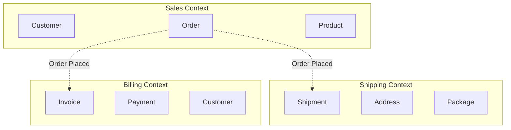
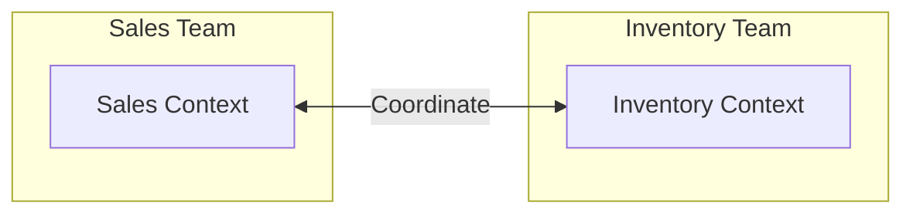
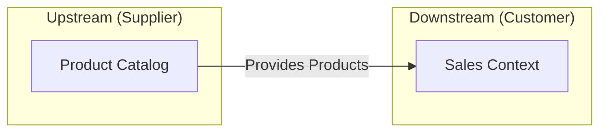
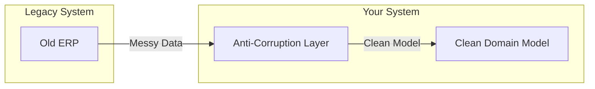
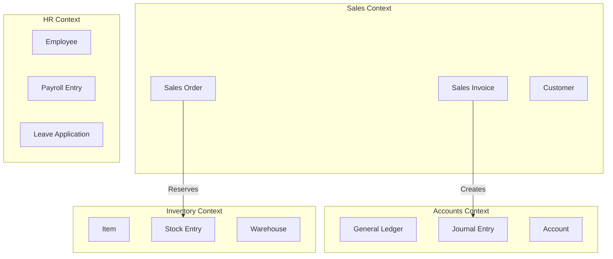
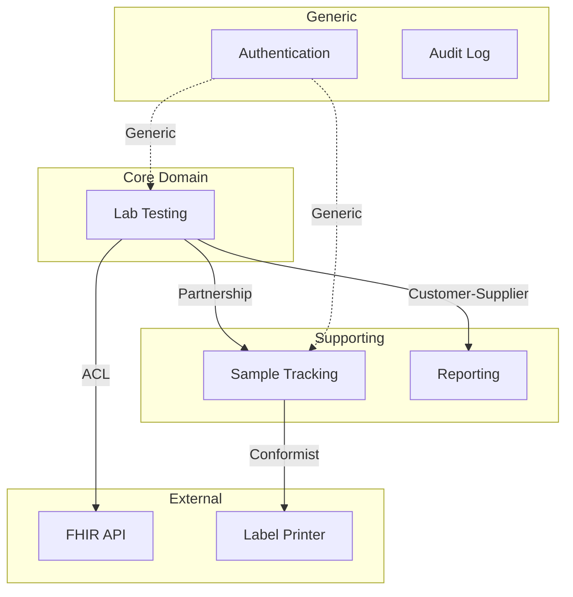
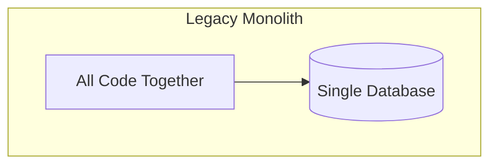
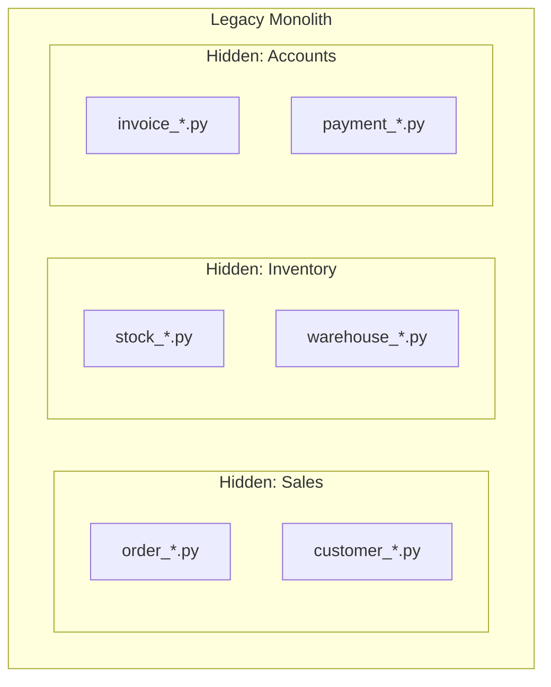
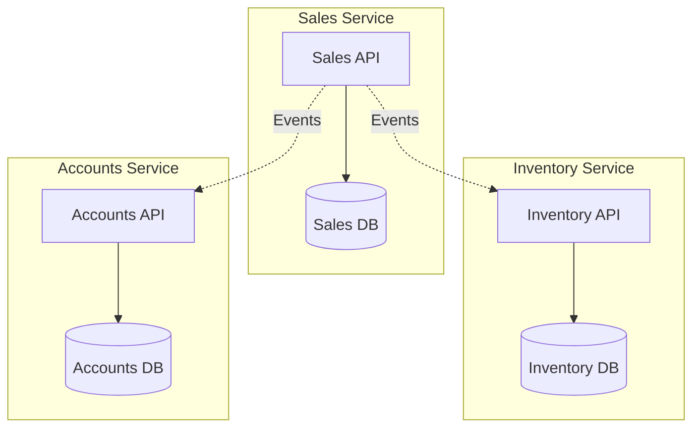

# Strategic Design

> **The big picture**: How to divide a system into manageable pieces

---

## What Is Strategic Design?

Strategic design is about **boundaries** and **relationships** at the macro level.

```
┌─────────────────────────────────────────────────────────────────────────┐
│                    STRATEGIC vs TACTICAL                                 │
├─────────────────────────────────────────────────────────────────────────┤
│                                                                          │
│  STRATEGIC DESIGN (This note)                                           │
│  └── Where to draw boundaries                                           │
│  └── How bounded contexts relate                                        │
│  └── Which parts to modernize first                                     │
│  └── Team organization                                                  │
│                                                                          │
│  TACTICAL DESIGN (Next note)                                            │
│  └── How to model inside a boundary                                     │
│  └── Entities, Value Objects, Aggregates                                │
│  └── Domain Events, Repositories                                        │
│                                                                          │
└─────────────────────────────────────────────────────────────────────────┘
```

---

## Core Concepts

### 1. Bounded Contexts

A boundary within which a model is consistent.



**Key insight**: `Customer` means different things in different contexts:
- **Sales**: Contact info, preferences, purchase history
- **Billing**: Payment methods, credit limit, billing address
- **Shipping**: Delivery address, delivery preferences

### 2. Ubiquitous Language

Each context has its own vocabulary.

| Term | Sales Context | Shipping Context | Billing Context |
|------|---------------|------------------|-----------------|
| **Customer** | Person who buys | Recipient | Account holder |
| **Address** | Contact address | Delivery location | Billing address |
| **Order** | Purchase request | Shipment source | Invoice basis |
| **Item** | Product selected | Package contents | Line item |

**Why this matters for modernization**: When you see `Customer` in legacy code, you need to know WHICH customer concept it represents.

### 3. Context Mapping

How bounded contexts relate to each other.

```
┌─────────────────────────────────────────────────────────────────────────┐
│                    CONTEXT RELATIONSHIPS                                 │
├─────────────────────────────────────────────────────────────────────────┤
│                                                                          │
│  PARTNERSHIP                                                            │
│  └── Two teams coordinate, mutual dependency                            │
│  └── Example: Sales and Inventory coordinate on stock levels            │
│                                                                          │
│  CUSTOMER-SUPPLIER                                                      │
│  └── Upstream (supplier) provides, downstream (customer) consumes       │
│  └── Example: Product Catalog (upstream) → Sales (downstream)           │
│                                                                          │
│  CONFORMIST                                                             │
│  └── Downstream conforms to upstream's model, no negotiation            │
│  └── Example: Your system conforms to Stripe's payment API              │
│                                                                          │
│  ANTI-CORRUPTION LAYER (ACL)                                            │
│  └── Downstream translates upstream's model to protect itself           │
│  └── Example: Translate legacy ERP data to clean domain model           │
│                                                                          │
│  OPEN HOST SERVICE                                                      │
│  └── Upstream provides a well-defined protocol for many consumers       │
│  └── Example: REST API that multiple systems consume                    │
│                                                                          │
│  PUBLISHED LANGUAGE                                                     │
│  └── Shared language for exchange (JSON schemas, protobuf)              │
│  └── Example: FHIR for healthcare data exchange                         │
│                                                                          │
└─────────────────────────────────────────────────────────────────────────┘
```

---

## Context Map Patterns

### Partnership



Both teams must coordinate changes. Neither can change without the other.

### Customer-Supplier



Catalog team provides data. Sales team requests features but catalog team decides.

### Anti-Corruption Layer



**This is critical for modernization!** The ACL translates legacy concepts to clean ones.

---

## Identifying Bounded Contexts

### Clues in Legacy Code

| Clue | What It Suggests |
|------|------------------|
| **Separate databases/schemas** | Likely separate contexts |
| **Different teams own different code** | Team boundaries often match contexts |
| **Same term, different meaning** | Context boundary |
| **Separate deployment units** | Likely separate contexts |
| **Integration points** | Boundaries between contexts |

### Process for Discovery

```
Step 1: List all the "nouns" in the system
        Customer, Order, Product, Invoice, Shipment, etc.

Step 2: Group nouns that are always used together
        {Order, OrderLine, Cart} — always together
        {Invoice, Payment, Receipt} — always together

Step 3: Find nouns that appear in multiple groups with different meanings
        Customer in {Sales} vs Customer in {Billing}
        → These are different contexts

Step 4: Draw boundaries around groups
        → Each group is a candidate bounded context

Step 5: Validate with business stakeholders
        → Do these boundaries make sense?
```

### Example: ERPNext Discovery



---

## Subdomains

Not all parts of a system are equally important.

### Types of Subdomains

```
┌─────────────────────────────────────────────────────────────────────────┐
│                    SUBDOMAIN TYPES                                       │
├─────────────────────────────────────────────────────────────────────────┤
│                                                                          │
│  CORE DOMAIN                                                            │
│  └── What makes the business unique                                     │
│  └── Competitive advantage                                              │
│  └── Worth investing heavily in                                         │
│  └── Example: Lab testing workflow in OpenElis                          │
│                                                                          │
│  SUPPORTING SUBDOMAIN                                                   │
│  └── Necessary but not unique                                           │
│  └── Custom to business but not differentiating                         │
│  └── Worth building, but don't over-engineer                            │
│  └── Example: Sample tracking in OpenElis                               │
│                                                                          │
│  GENERIC SUBDOMAIN                                                      │
│  └── Same for everyone                                                  │
│  └── Buy or use open source                                             │
│  └── Don't build yourself                                               │
│  └── Example: User authentication, email sending                        │
│                                                                          │
└─────────────────────────────────────────────────────────────────────────┘
```

### Why This Matters for Modernization

| Subdomain Type | Modernization Priority | Approach |
|----------------|------------------------|----------|
| **Core** | HIGH | Careful, incremental, test heavily |
| **Supporting** | MEDIUM | Can be more aggressive |
| **Generic** | LOW | Replace with off-the-shelf |

---

## Context Mapping Diagram

A complete view of how contexts relate.



---

## Applying to Legacy Modernization

### Step 1: Draw the Current State

Before modernizing, understand what exists:



### Step 2: Identify Hidden Contexts

Look for natural seams in the monolith:



### Step 3: Plan Target State

Design where you want to end up:



### Step 4: Define the ACL

The translation layer between old and new:

```python
# Anti-Corruption Layer Example

class LegacyOrderAdapter:
    """Translates legacy order data to clean domain model."""

    def to_domain(self, legacy_order: dict) -> Order:
        """Convert legacy format to domain model."""
        return Order(
            id=OrderId(legacy_order['ORDER_NUM']),  # Legacy uses ORDER_NUM
            customer=self._map_customer(legacy_order['CUST_CODE']),
            items=self._map_items(legacy_order['LINES']),
            status=self._map_status(legacy_order['STAT'])  # Legacy uses codes
        )

    def _map_status(self, legacy_code: str) -> OrderStatus:
        """Translate legacy status codes to domain status."""
        mapping = {
            'N': OrderStatus.NEW,
            'P': OrderStatus.PROCESSING,
            'S': OrderStatus.SHIPPED,
            'C': OrderStatus.COMPLETED,
            'X': OrderStatus.CANCELLED,
        }
        return mapping.get(legacy_code, OrderStatus.UNKNOWN)
```

---

## Key Takeaways

1. **Bounded Contexts** define where models are consistent
2. **Ubiquitous Language** differs between contexts
3. **Context Mapping** shows how contexts relate
4. **Subdomains** tell you where to invest effort
5. **ACL** protects new code from legacy mess
6. **Discovery** before design — understand what exists

---

## For Your Week-1 Project

When analyzing your target codebase:

1. **List the major "nouns"** (entities) you find
2. **Group them** by which ones are used together
3. **Identify where terms have different meanings**
4. **Draw a rough context map**
5. **Classify each area** as Core/Supporting/Generic

---

## Related

- [Bounded Contexts Deep Dive](./02-Bounded-Contexts.md)
- [Tactical Patterns](./04-Tactical-Patterns.md)
- [Applied to ERPNext/Bahmni/OpenElis](./05-Applied-To-Projects.md)
- [Why DDD Matters](./01-Why-DDD-Matters.md)
