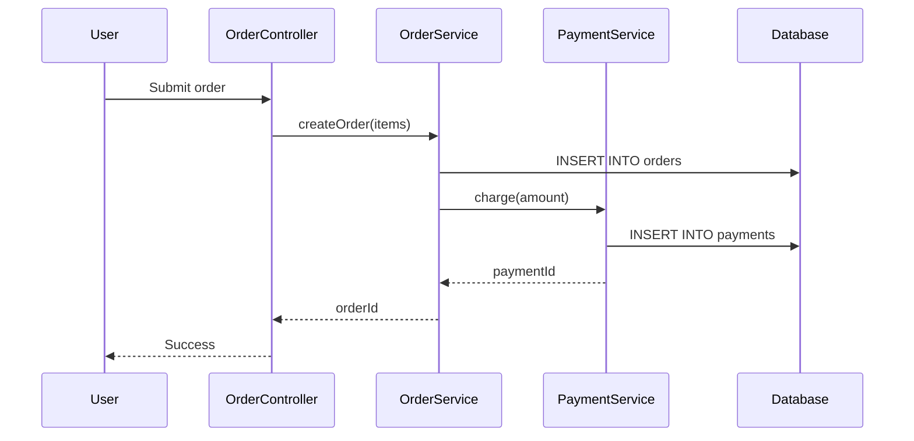

# Technical Architecture: Multi-Mode Knowledge Extraction

## Beyond Simple Code Indexing

> *Understanding code requires multiple perspectives - syntax, semantics, runtime behavior, and business context.*

---

## The Problem with Single-Mode Indexing

Most AI coding tools use a single indexing approach (usually vector embeddings of text chunks). This creates blind spots:

| Single-Mode Approach | What It Misses |
|---------------------|----------------|
| **Text-only chunks** | Precise function boundaries, type information |
| **Symbol-only chunks** | Flow understanding, business context |
| **Static analysis only** | Runtime behavior, performance bottlenecks |
| **Code-only** | Business rules documented elsewhere |

---

## The 4-Mode Architecture

A comprehensive code intelligence system needs **four complementary modes**:

```
┌─────────────────────────────────────────────────────────────────────────────┐
│                    FOUR-MODE KNOWLEDGE EXTRACTION                            │
├─────────────────────────────────────────────────────────────────────────────┤
│                                                                              │
│  MODE 1: TEXT-BASED CHUNKS                                                  │
│  ├── Purpose: Flow understanding, business context in comments              │
│  ├── Method: Overlapping text windows (500-1500 tokens)                     │
│  ├── Libraries: tiktoken, LangChain text splitters                          │
│  └── Finds: "How does discount calculation work?" (narrative)               │
│                                                                              │
│  MODE 2: SYMBOL CHUNKS (AST-Based)                                          │
│  ├── Purpose: Precise code navigation, type metadata                        │
│  ├── Method: tree-sitter AST parsing                                        │
│  ├── Libraries: tree-sitter (50+ language grammars)                         │
│  └── Finds: "Show me DiscountService.calculateDiscount()" (exact)           │
│                                                                              │
│  MODE 3: RUNTIME TRACES                                                     │
│  ├── Purpose: Actual execution behavior, performance                        │
│  ├── Method: Profiler log parsing, execution traces                         │
│  ├── Libraries: OpenTelemetry, framework debug modules                      │
│  └── Finds: "What's slow in the checkout flow?" (performance)               │
│                                                                              │
│  MODE 4: WORKFLOW/CALL GRAPHS                                               │
│  ├── Purpose: Multi-step processes, dependencies                            │
│  ├── Method: Static dependency analysis + runtime correlation               │
│  ├── Libraries: madge, Mermaid for visualization                            │
│  └── Finds: "What happens when a user submits an order?" (process)          │
│                                                                              │
└─────────────────────────────────────────────────────────────────────────────┘
```

---

## Mode 1: Text-Based Chunks

### Purpose
- Flow understanding across functions
- Business context preservation (comments, docblocks)
- Narrative code reading

### Key Technique: Token-Aware Splitting

```typescript
import { encoding_for_model } from 'tiktoken';

// Accurate token counting (same as LLM uses)
const enc = encoding_for_model('gpt-4');

function chunkByTokens(text: string, maxTokens: number = 1000, overlap: number = 200) {
  const tokens = enc.encode(text);
  const chunks = [];
  let start = 0;

  while (start < tokens.length) {
    const end = start + maxTokens;
    const chunkTokens = tokens.slice(start, end);
    chunks.push(enc.decode(chunkTokens));
    start += (maxTokens - overlap);  // Overlap for context continuity
  }

  return chunks;
}
```

### Quality Criteria

| Metric | Good | Bad |
|--------|------|-----|
| **Token count** | 500-1500 tokens | <200 or >3000 |
| **Completeness** | Ends at statement boundary | Cut mid-statement |
| **Context** | Includes surrounding comments | Stripped of comments |
| **Business value** | Contains logic | Just imports/boilerplate |

---

## Mode 2: Symbol Chunks (AST-Based)

### Purpose
- Precise code navigation
- Type information extraction
- Clean function/class boundaries

### Key Technique: tree-sitter Parsing

```typescript
import Parser from 'tree-sitter';
import TypeScript from 'tree-sitter-typescript';

const parser = new Parser();
parser.setLanguage(TypeScript.typescript);

function extractSymbols(sourceCode: string) {
  const tree = parser.parse(sourceCode);
  const symbols = [];

  function traverse(node) {
    // Extract functions, classes, methods
    if (['function_declaration', 'class_declaration', 'method_definition'].includes(node.type)) {
      symbols.push({
        type: node.type,
        name: node.childForFieldName('name')?.text,
        startLine: node.startPosition.row,
        endLine: node.endPosition.row,
        content: node.text
      });
    }

    for (const child of node.children) {
      traverse(child);
    }
  }

  traverse(tree.rootNode);
  return symbols;
}
```

### Supported Languages (tree-sitter)

| Language | Grammar | Framework-Specific Patterns |
|----------|---------|----------------------------|
| Java | tree-sitter-java | Spring annotations, Hibernate entities |
| Python | tree-sitter-python | Django models, FastAPI routes |
| PHP | tree-sitter-php | Laravel Eloquent, Yii2 ActiveRecord |
| TypeScript | tree-sitter-typescript | NestJS decorators, Express routes |
| Ruby | tree-sitter-ruby | Rails models, controllers |

---

## Mode 3: Runtime Traces

### Purpose
- Actual execution behavior
- Performance bottleneck identification
- Edge case discovery

### Key Technique: Profiler Log Parsing

```typescript
interface RuntimeTrace {
  timestamp: Date;
  entryPoint: string;           // "OrderController.submit"
  callStack: string[];          // ["OrderService.create", "PaymentService.charge"]
  sqlQueries: SQLQuery[];       // All database queries in trace
  executionTimeMs: number;
  memoryPeakMb: number;
}

interface SQLQuery {
  sql: string;
  timeMs: number;
  rowsAffected: number;
}

// Parse profiler logs
function parseRuntimeTraces(logPath: string): RuntimeTrace[] {
  // Framework-specific parsing
  // Returns structured trace objects
}
```

### What Runtime Reveals (Static Analysis Misses)

| Discovery | Static Analysis | Runtime Analysis |
|-----------|----------------|------------------|
| **Hot paths** | All paths equal | 80% of traffic hits 3 routes |
| **N+1 queries** | Invisible | 47 queries where 1 expected |
| **Edge cases** | Requires manual review | Actual error patterns |
| **Performance** | Unknown | 850ms bottleneck identified |

---

## Mode 4: Workflow/Call Graphs

### Purpose
- Multi-step business processes
- Method call chains
- Transaction boundaries
- Side effects tracking

### Key Technique: Graph Building

```typescript
interface CallGraph {
  nodes: GraphNode[];
  edges: GraphEdge[];
}

interface GraphNode {
  id: string;
  label: string;           // "OrderService.createOrder"
  type: 'controller' | 'service' | 'repository' | 'external';
  file: string;
  line: number;
}

interface GraphEdge {
  from: string;
  to: string;
  type: 'calls' | 'extends' | 'implements' | 'triggers';
}

// Build call graph from entry point
function buildCallGraph(entryPoint: string, maxDepth: number = 5): CallGraph {
  const graph = { nodes: [], edges: [] };
  const visited = new Set();

  function traverse(methodName: string, depth: number) {
    if (depth > maxDepth || visited.has(methodName)) return;
    visited.add(methodName);

    const symbol = findSymbol(methodName);
    if (!symbol) return;

    graph.nodes.push({
      id: symbol.id,
      label: methodName,
      type: categorizeSymbol(symbol),
      file: symbol.filePath,
      line: symbol.startLine
    });

    const calls = extractMethodCalls(symbol.content);
    for (const call of calls) {
      graph.edges.push({ from: symbol.id, to: call, type: 'calls' });
      traverse(call, depth + 1);
    }
  }

  traverse(entryPoint, 0);
  return graph;
}
```

### Visualization with Mermaid



---

## How the 4 Modes Work Together

### Discovery Cycle

```
1. STATIC DISCOVERY (Modes 1 & 2)
   ├─ Text chunks: Understand flow narratively
   ├─ Symbol chunks: Map precise code locations
   └─ Build initial understanding

2. RUNTIME VALIDATION (Mode 3)
   ├─ Profiler traces: Validate actual execution
   ├─ Discover missing steps (code analysis missed)
   └─ Identify performance bottlenecks

3. WORKFLOW SYNTHESIS (Mode 4)
   ├─ Combine static + runtime insights
   ├─ Generate call graphs
   ├─ Create sequence diagrams
   └─ Document edge cases

4. REFINEMENT LOOP
   ├─ Runtime reveals gaps → Update text/symbol chunks
   ├─ Workflow changes → Re-index affected chunks
   └─ Continuous improvement
```

### Example Query Flow

```
Query: "How does the checkout process work?"

┌─────────────────────────────────────────────────────────────────┐
│ STEP 1: ENTRY POINT DISCOVERY                                   │
├─────────────────────────────────────────────────────────────────┤
│ Text chunks find: "checkout", "order submission", "payment"     │
│ Symbol chunks find: CheckoutController, OrderService            │
│ Result: Identify entry point (CheckoutController.submit)        │
└─────────────────────────────────────────────────────────────────┘
                            ↓
┌─────────────────────────────────────────────────────────────────┐
│ STEP 2: GRAPH EXPANSION                                         │
├─────────────────────────────────────────────────────────────────┤
│ Build call graph from CheckoutController.submit                 │
│ Discover: OrderService, PaymentService, InventoryService        │
│ Result: Complete dependency tree (15 nodes, 23 edges)           │
└─────────────────────────────────────────────────────────────────┘
                            ↓
┌─────────────────────────────────────────────────────────────────┐
│ STEP 3: RUNTIME ENRICHMENT                                      │
├─────────────────────────────────────────────────────────────────┤
│ Match runtime traces to checkout flow                           │
│ Discover: PaymentService.charge is 850ms bottleneck             │
│ Result: Performance insights + actual execution data            │
└─────────────────────────────────────────────────────────────────┘
                            ↓
┌─────────────────────────────────────────────────────────────────┐
│ STEP 4: SYNTHESIS                                               │
├─────────────────────────────────────────────────────────────────┤
│ Combine all modes into comprehensive answer                     │
│ Include: Code, call graph, performance data, edge cases         │
│ Result: Complete checkout flow documentation                    │
└─────────────────────────────────────────────────────────────────┘
```

---

## Open Source Libraries to Use

| Mode | Primary Library | Alternative | Purpose |
|------|----------------|-------------|---------|
| **Text Chunks** | tiktoken | LangChain | Accurate token counting |
| **Symbol Chunks** | tree-sitter | ts-morph (TypeScript) | AST parsing |
| **Runtime Traces** | OpenTelemetry | Framework debug modules | Execution tracing |
| **Workflows** | madge | graphviz | Dependency graphs |
| **Visualization** | Mermaid | PlantUML | Sequence diagrams |
| **Embeddings** | Ollama | OpenAI | Vector generation |
| **Vector DB** | LanceDB | ChromaDB | Embedded storage |

---

## Implementation Approach for Interns

### Week 2: Build Foundation

1. **Text Chunker**
   - Use tiktoken for token counting
   - Implement overlapping chunks with code-aware boundaries
   - Store in LanceDB with `chunk_type: 'text'`

2. **Symbol Extractor**
   - Use tree-sitter for your target language
   - Extract functions, classes, methods
   - Store in LanceDB with `chunk_type: 'symbol'`

### Week 3: Add Graph Capabilities

3. **Call Graph Builder**
   - Extract method calls from symbol content
   - Build dependency graph
   - Store edges in SQLite (source → target)

4. **Workflow Tracker**
   - Document entry points (controllers, routes)
   - Build multi-step workflow documentation
   - Generate Mermaid diagrams

### Week 4: Runtime Integration (If Time Permits)

5. **Runtime Trace Parser**
   - Parse framework debug/profiler logs
   - Link traces to symbol chunks
   - Enrich with performance data

---

## Success Metrics

| Metric | Target | How to Measure |
|--------|--------|----------------|
| **Symbol coverage** | 90%+ | Symbols extracted / actual symbols |
| **Query accuracy** | 80%+ | Relevant results in top 5 |
| **Call graph completeness** | 85%+ | Edges found / actual calls |
| **Runtime correlation** | 70%+ | Traces linked to symbols |

---

## Related

- [AI Internship Overview](./00-Index.md)
- [Existing Tools Research](./03-Existing-Tools-Research.md)
- [Quality Metrics - Measuring Tool Quality](./07-Quality-Metrics.md)
- [Validation Projects](./08-Validation-Projects.md)
- [AI Coding Tools Comparison](./05-AI-Coding-Tools-Comparison.md)

---

*Last Updated: 2025-01-12*
